# MediCore - Medical Profile Management System

This is a comprehensive **Medical Profile Management System** built with a microservices architecture using modern, production-grade tools like **Spring Boot**, **Kafka**, **Docker**, and **AWS**. This repository will grow as i add new services and features.

> ⚙️ This is a learning-focused, end-to-end backend project.


## Microservices Overview (in progress)

| Service Name               | Description                  | Status       |
|----------------------------|------------------------------|--------------|
| [Medical Profile Service](#medical-profile-service)| Manages medical profile data | Implemented  |
| [Medical Billing Service](#medical-billing-service)| Manages medical billing data | Implemented  |
| [Medical Analytics Service](#medical-analytics-service)| Consumes events for analytics | Implemented  |
| [API Gateway](#api-gateway)| single entry point for all client requests | Implemented  |
| [Auth Service](#auth-service)| Securing Microservices with JWT Authentication | Implementing |


---

## Medical Profile Service

A microservice built with **Spring Boot 3.5.0**, **Java 21 (Oracle JDK)**, and **PostgreSQL**. This service is part of a larger **MediCore - Medical Profile Management System** project. It is container-ready, supports both REST and gRPC-based communication and will be integrated with **Kafka**, **AWS**, and **Docker** for cloud deployment and communication.


## Table of Contents

- [Features](#features)
- [Tech Stack](#tech-stack)
- [Dependencies](#dependencies)
- [Project Setup](#project-setup)
- [Development Configuration](#development-configuration)
- [Run Locally Using H2 DB](#run-locally-using-h2-db)
- [Access H2 Console](#access-h2-console)
- [Docker Setup](#docker-setup)
  - [PostgreSQL Container](#postgresql-container)
  - [Dockerfile For Application](#dockerfile-for-application)
  - [Docker Run Configuration](#docker-run-configuration)
- [PostgreSQL Configuration in `application.properties`](#postgresql-configuration-in-applicationproperties)
- [IntelliJ DB Integration](#intellij-db-integration)
- [API Testing in Dockerized Setup](#api-testing-in-dockerized-setup)
- [Global Error Handling](#global-error-handling)
- [OpenAPI Documentation](#openapi-documentation)
- [gRPC Integration](#grpc-integration)
- [Asynchronous Event-Driven Communication with Kafka](#asynchronous-event-driven-communication-with-kafka)
- [Kafka Setup with Docker (KRaft Mode)](#kafka-setup-with-docker-kraft-mode)
- [Kafka Producer Implementation](#kafka-producer-implementation)
- [Kafka Consumer Implementation](#kafka-consumer-implementation)
- [Development Notes / Change Log](#development-notes--change-log)


## Features

- **RESTful API**: Provides endpoints to create, retrieve, update, and delete medical profiles.
- **Layered Architecture**: Follows a clean separation of concerns across Controller, Service, Repository, DTO, Model, and Mapper layers.
- **Validation System**:
  - Field-level annotations ensure input integrity.
  - **Grouped validation** using interfaces (e.g. `CreateMedicalProfileValidationGroup`) applies context-specific rules like "registration time" only during create operations.
- **DTO and Mapper Support**: Maps between entities and DTOs to keep the API contract clean and decoupled from internal database models.
- **gRPC Client Integration**: Communicates with `medical-billing-service` to auto-create billing accounts when profiles are added.
- **OpenAPI Documentation**: Integrated with SpringDoc using `@Tag` and `@Operation` annotations to generate Swagger-compatible docs.
- **Global Exception Handling**: Centralized with `@ControllerAdvice` for consistent, structured error responses.
- **Database Flexibility**:
  - **H2 in-memory** for lightweight development/testing.
  - **PostgreSQL** via Docker for production-ready persistence.
- **Containerized Deployment**: Built using a multi-stage Dockerfile for efficient builds and runs alongside PostgreSQL in Docker network.


## Tech Stack

| Category   | Technology           | Description                                        |
| ---------- |----------------------| -------------------------------------------------- |
| Backend    | Spring Boot 3.5.0    | Framework for building RESTful microservices       |
| Language   | Java 21 (Oracle JDK) | Long-Term Support version for enterprise stability |
| Database   | PostgreSQL, H2 (dev) | PostgreSQL for production, H2 for dev/testing      |
| Validation | Hibernate Validator  | Annotation-based request and entity validation     |
| Docs       | SpringDoc OpenAPI    | Auto-generates Swagger UI from code annotations    |
| Container  | Docker               | Containerization using multi-stage build           |
| Messaging  | Kafka                | For event-driven communication between services    |
| Cloud      | AWS (planned)        | For deploying microservices in the cloud           |


## Dependencies

- `spring-boot-starter-web`: For creating REST APIs
- `spring-boot-starter-data-jpa`: For interacting with databases using JPA
- `spring-boot-devtools`: Enables hot reload during development
- `spring-boot-starter-validation`: Supports bean validation using annotations
- `postgresql`: JDBC driver to connect to PostgreSQL
- `com.h2database:h2`: In-memory database for development and testing
- `springdoc-openapi-starter-webmvc-ui`: To generate OpenAPI docs with Swagger UI
- `io.grpc:grpc-netty-shaded` : For gRPC server implementation
- `io.grpc:grpc-stub` : For gRPC client stubs
- `io.grpc:grpc-protobuf` : For Protocol Buffers support in gRPC
- `com.google.protobuf:protobuf-java` : For Protocol Buffers Java support
- `net.devh:grpc-client-spring-boot-starter` : For integrating gRPC client with Spring Boot


## Project Setup

### Prerequisites

- Java 21 installed
- Maven or Gradle (depending on your build tool)
- IDE (e.g., IntelliJ IDEA)
- Docker

## Development Configuration

- `application.properties`: Configured to use the H2 database for ease of development
- `server.port=8081`: Port changed from default `8080` to avoid conflicts
- `data.sql`: Auto-loaded by Spring Boot to insert dummy data at startup


### Run Locally using H2 DB

1. Clone the repository
2. Navigate to `medical-profile-service`
3. Run the application using your IDE or command line:
   ```bash
   ./mvnw spring-boot:run
   # or
   ./gradlew bootRun
   ```
4. Access the API at: `http://localhost:8081/medical-profiles`


### Access H2 Console

Spring Boot makes it easy to view and interact with the H2 database via a browser:

- URL: `http://localhost:8081/h2-console`
- JDBC URL: `jdbc:h2:mem:testdb`
- Username: `profile`
- Password: `profile` *(unless you changed it in application.properties)*

Make Sure to uncomment H2-configuration in your `application.properties` file.
Make sure this is present in your `application.properties`:

```properties
spring.h2.console.enabled=true
spring.h2.console.path=/h2-console
```


## Docker Setup

### PostgreSQL Container

A PostgreSQL container was created using the latest PostgreSQL image with the following configuration:

```bash
docker run --name medical-profile-service-db \
  -e POSTGRES_USER=profile \
  -e POSTGRES_PASSWORD=profile \
  -e POSTGRES_DB=db \
  -p 5000:5432 \
  -v medical-profile-db-data:/var/lib/postgresql/data \
  --network internal \
  -d postgres:latest
```

- Port mapped: `5000:5432`
- Persistent storage: Named volume `medical-profile-db-data`
- Network: Internal Docker network named `internal`

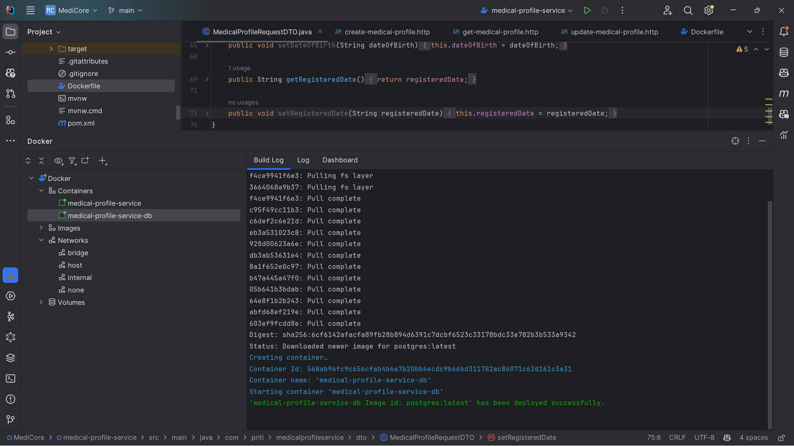


### Dockerfile for Application

A multi-stage Dockerfile was created in the `medical-profile-service` directory:

### Docker Run Configuration

In IntelliJ IDEA:

- Image name: `medical-profile-service:latest`
- Container name: `medical-profile-service`
- Dockerfile path: `medical-profile-service/Dockerfile`
- Environment Variables:
  - `SPRING_DATASOURCE_URL=jdbc:postgresql://medical-profile-service-db:5432/db`
  - `SPRING_DATASOURCE_USERNAME=profile`
  - `SPRING_DATASOURCE_PASSWORD=profile`
  - `SPRING_JPA_HIBERNATE_DDL_AUTO=update`
  - `SPRING_SQL_INIT_MODE=always`
- Port Binding: `8081:8081`
- Run Option: `--network internal`

### PostgreSQL Configuration in `application.properties`

Commented out H2-related settings and retained only essential production config:

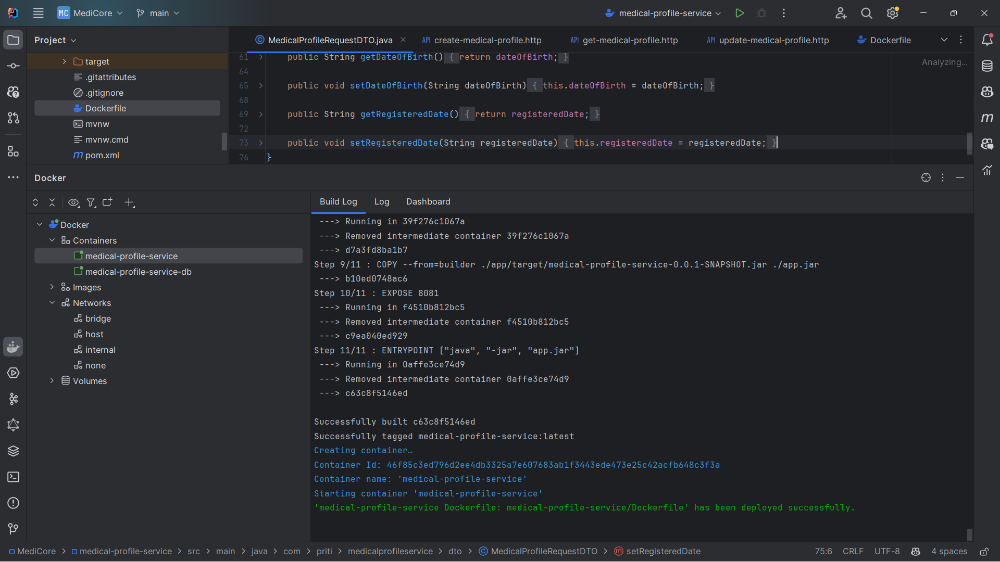


### IntelliJ DB Integration

- Connected to the running PostgreSQL container from IntelliJ using:
  - Name: `medical-profile-service-db`
  - JDBC URL: `jdbc:postgresql://localhost:5000/db`
  - Username: `profile`, Password: `profile`
- Verified: Tables created and dummy data from `data.sql` available in database

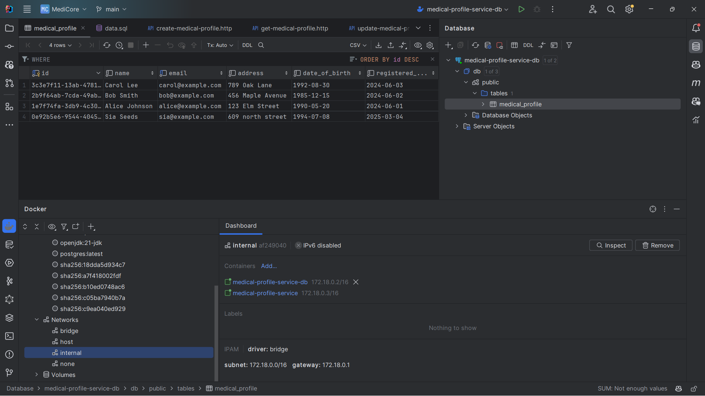


### API Testing in Dockerized Setup

Tested all `.http` request files (`GET`, `POST`, `PUT`, `DELETE`) against the Dockerized application connected to PostgreSQL. All endpoints worked as expected.

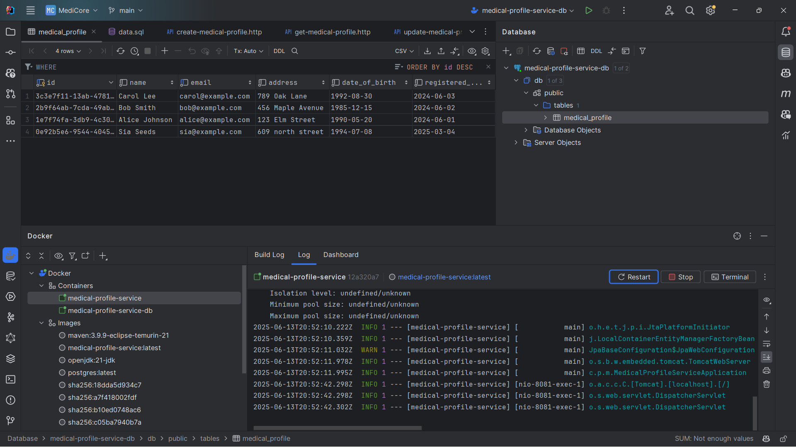


## API Endpoints

```
GET    /medical-profiles          # Fetch all profiles
POST   /medical-profiles          # Create new profile
PUT    /medical-profiles/{id}     # Update profile by ID
DELETE /medical-profiles/{id}     # Delete profile by ID
```
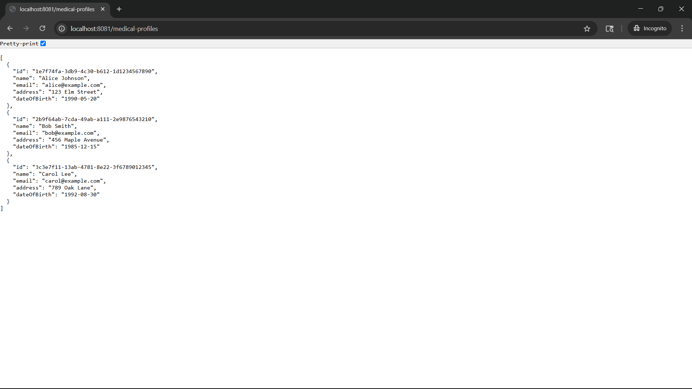


## OpenAPI Documentation

- Local API Docs: [http://localhost:8081/v3/api-docs](http://localhost:8081/v3/api-docs)

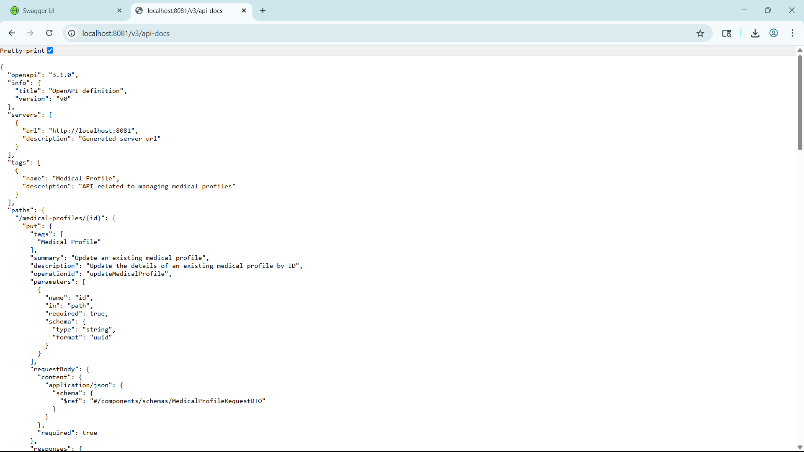

- Swagger UI (auto-generated): [http://localhost:8081/swagger-ui/index.html](http://localhost:8081/swagger-ui/index.html)

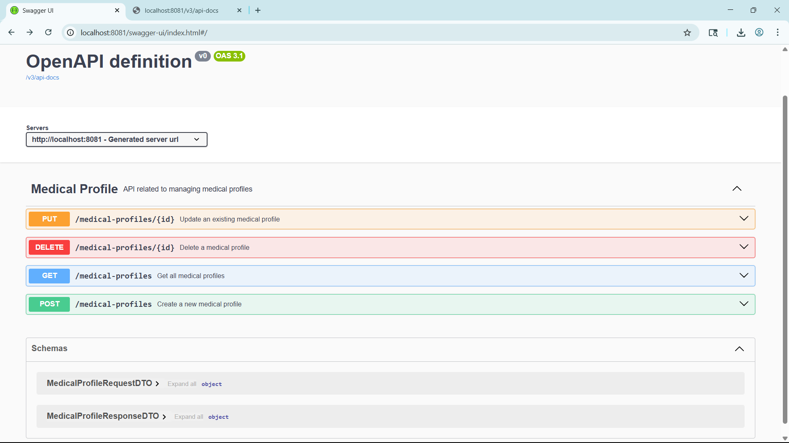

These are generated using annotations like `@Tag`, `@Operation`, etc., in controller classes.

You can copy the raw OpenAPI JSON from `/v3/api-docs` and paste it into [Swagger Editor](https://editor.swagger.io/) for interactive documentation.


## API Testing with HTTP Files

This project uses `.http` files located under `api-request/medical-profile-service/` to test API endpoints.

Examples:

- `get-medical-profile.http` – Tests `GET /medical-profiles`
  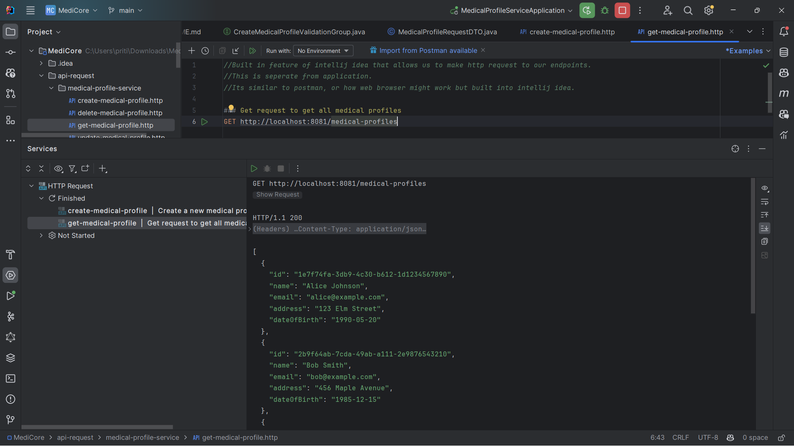

- `create-medical-profile.http` – Tests `POST /medical-profiles`
  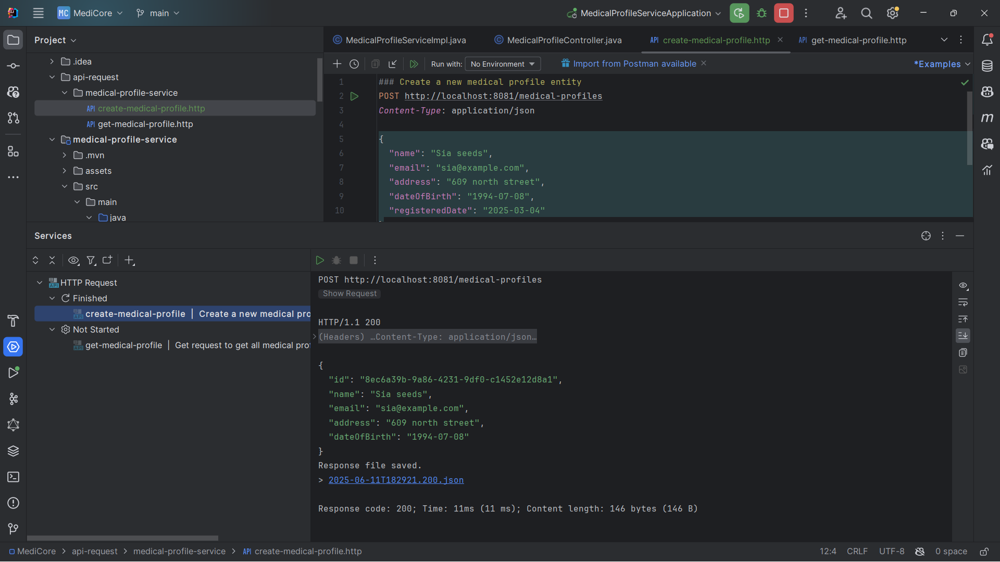

- `update-medical-profile.http` – Tests `PUT /medical-profiles/{id}`
  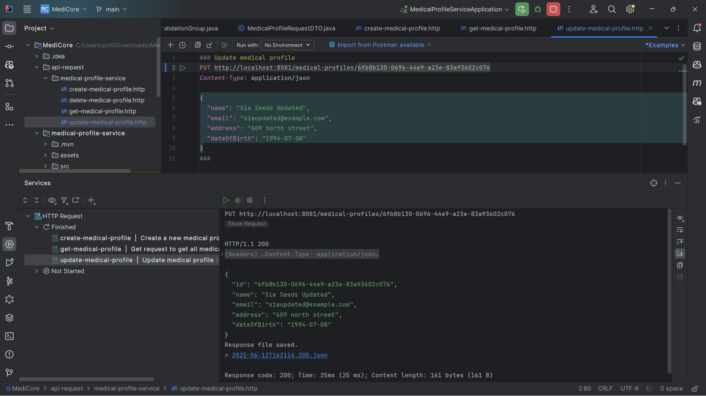

- `delete-medical-profile.http` – Tests `DELETE /medical-profiles/{id}`
  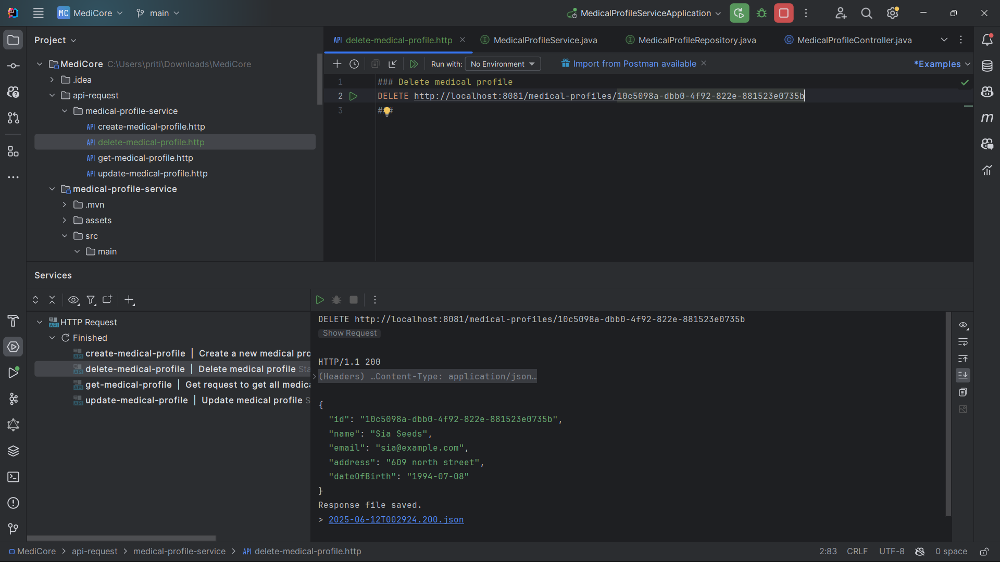

You can use IntelliJ IDEA or VS Code REST Client extension to run these files.


## Global Error Handling

A centralized exception handling mechanism is in place using `@ControllerAdvice`. It catches and formats errors like:

- Duplicate email constraint violations
- Entity not found
- Invalid request body

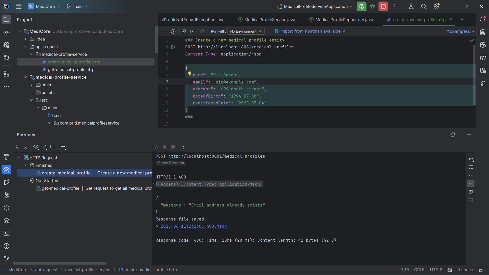

This ensures consistent error responses across the API.


## gRPC Integration

To enable gRPC-based communication between `medical-profile-service` (the client) and `medical-billing-service` (the server), we use a **Protocol Buffers (**``**) file**. This file acts as a contract that defines:

- The structure of the request and response messages
- The gRPC service name and its RPC methods (endpoints)
- The Java package for generated classes

In our case, the file is named `medical_billing_service.proto`, and it defines a `MedicalBillingService` with an RPC method:

```proto
rpc CreateMedicalBillingAccount (BillingRequest) returns (BillingResponse);
```

This allows the profile service to send a `BillingRequest` and receive a `BillingResponse` when a medical profile is created.

### Why We Added the Proto File Here

gRPC requires both client and server to have access to the same `.proto` definition so that matching Java classes can be generated. Although the file originated in the `medical-billing-service` module (which hosts the server logic), we **copied it into the **``** directory of **`` to:

- Generate gRPC client stubs during the Maven build process
- Maintain service contract alignment with the billing service
- Avoid direct dependency sharing for now (future improvement: share via a central proto module)

This setup ensures the profile service can invoke billing RPCs with type-safe, auto-generated Java classes.


### Proto Setup

* Copied the shared `medical_billing_service.proto` file from `medical-billing-service` to `src/main/proto/` in `medical-profile-service`
* Configured `protobuf-maven-plugin` in `pom.xml` to compile `.proto` files into Java classes
* Ran `mvn compile` to generate gRPC stubs

### gRPC Client Implementation

* Created `MedicalBillingServiceGrpcClient` class under `grpc` package
* Uses a **blocking stub** to call `CreateMedicalBillingAccount` on the remote `medical-billing-service`
* Constructed `BillingRequest` with id, name and email from the profile

### Client Configuration

In `application.properties`:

```properties
billing.service.address=localhost
billing.service.grpc.port=9001
```

Can be overridden via environment variables in Docker setup. To support gRPC communication between containers, we updated the Docker run configuration for `medical-profile-service` to include:

- `BILLING_SERVICE_ADDRESS=medical-billing-service`
- `BILLING_SERVICE_GRPC_PORT=9001`

This ensures that the client (profile service) can successfully resolve and connect to the gRPC server (billing service) running in another container within the same Docker internal network.
These match the server container’s hostname and port within the internal Docker network.
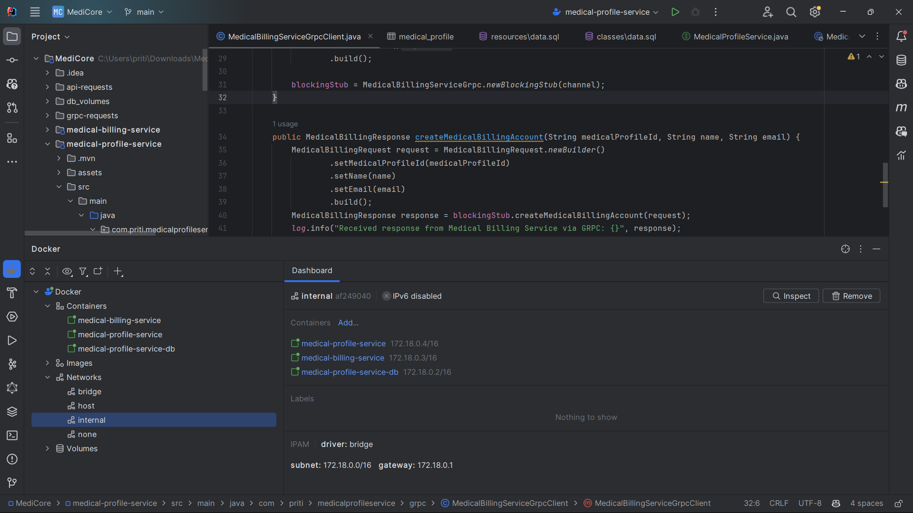

### Profile-to-Billing Integration

* On successful creation of a **medical profile**, the service automatically invokes the gRPC client to create a **billing account** in `medical-billing-service`
* This integration is triggered inside the profile creation service logic

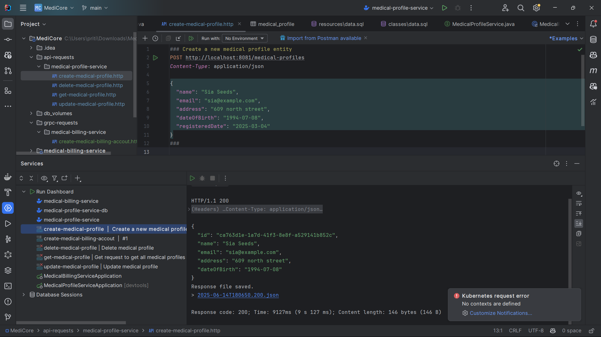
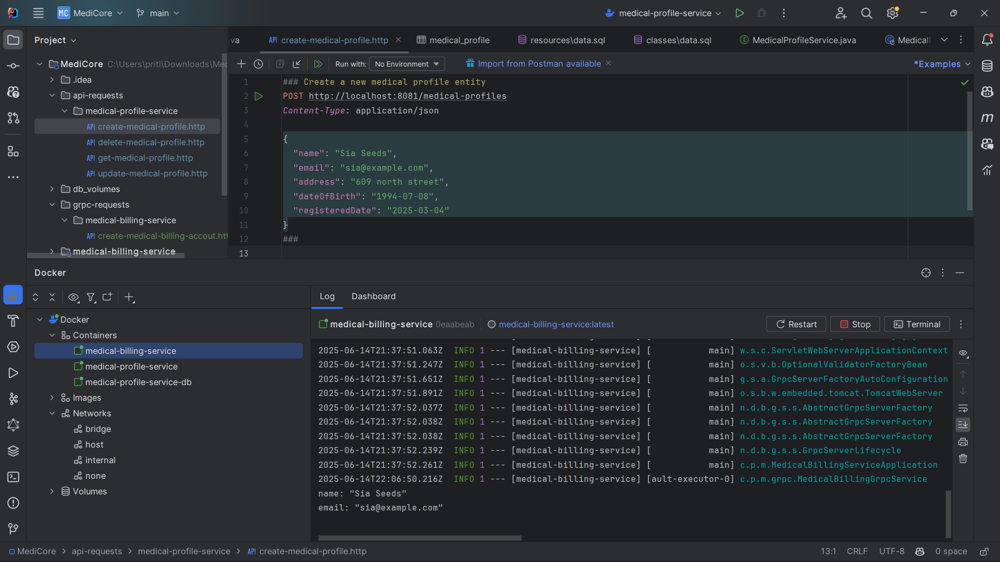
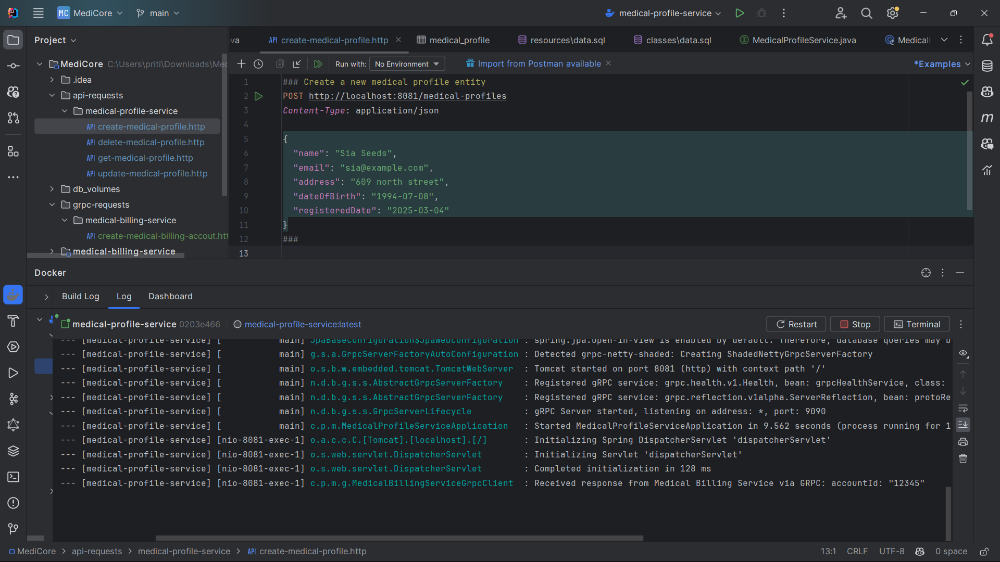

## Asynchronous Event-Driven Communication with Kafka

To decouple services and improve scalability, we use **Kafka** as the backbone for asynchronous, event-driven communication within the MediCore ecosystem.

### Why Kafka?

Till now, microservices communicates synchronously using REST APIs or gRPC in this project. While this is suitable for simple, one-to-one interactions, it introduces significant drawbacks:

* **Latency**: Each additional service call increases total processing time.
* **Tight Coupling**: Failures or slow responses in one service can block others.
* **Scalability Bottlenecks**: High request volume magnifies inter-service traffic.

By introducing **Kafka**, we transform the architecture into an **event-driven** model. Now, services **publish events** rather than making direct calls, and other services **consume these events** asynchronously.

### Use Case: Medical Profile Created Event

When a new medical profile is created in the `medical-profile-service`, it publishes a **`MedicalProfileEvent`** to a Kafka topic.
This event includes relevant data like medical profile ID, name, email, event type.

### Event Flow Overview

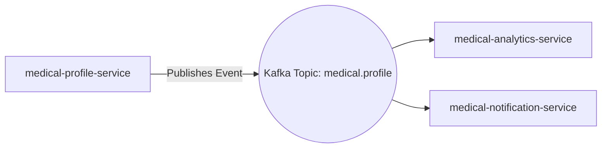
```mermaid
graph LR
    A[medical-profile-service] -- Publishes Event --> B((Kafka Topic: medical.profile))
    B --> C[medical-analytics-service]
    B --> D[medical-notification-service]
```

When a new medical profile is created, the `medical-profile-service` publishes a `MedicalProfileEvent` event to a Kafka topic (e.g., `medical.profile`) and proceeds with its workflow without waiting for any consumers.

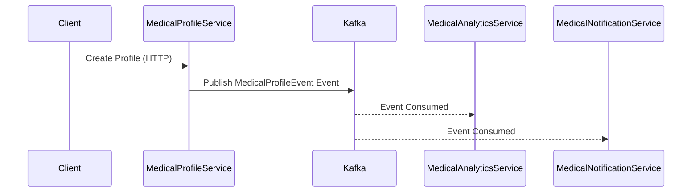
```mermaid
sequenceDiagram
    participant Client
    participant MedicalProfileService
    participant Kafka
    participant MedicalAnalyticsService
    participant MedicalNotificationService

    Client->>MedicalProfileService: Create Profile (HTTP)
    MedicalProfileService->>Kafka: Publish MedicalProfileEvent Event
    Kafka-->>MedicalAnalyticsService: Event Consumed
    Kafka-->>MedicalNotificationService: Event Consumed
```
Each of these services independently subscribes to the `medical-profile` topic and handles events at their own pace.

### Services Listening to This Event

* **Medical Analytics Service**
  Subscribes to `medical.profile` to update internal metrics and reporting datasets.

* **Medical Notification Service**
  Subscribes to the same event to trigger welcome emails, alerts, or push notifications.

### Benefits

* **Non-blocking**: Profile creation doesn't wait for downstream services to respond.
* **Scalable**: Kafka handles high throughput and allows for horizontal scaling of consumers.
* **Loose Coupling**: New services can be added as subscribers without modifying the publisher. Services are not tightly bound to one another.
* **Resilience**: Temporary consumer downtime doesn't affect the publishing flow. It ensures fault tolerance by retaining events until they can be processed.
* **Extensibility**: New services can subscribe to the topic without changing existing code.

## Kafka Setup with Docker (KRaft Mode)

We run Kafka using the Bitnami Docker image in KRaft mode (no ZooKeeper) with multiple listeners configured for internal and external communication.

### Docker Image Configuration

| Setting | Value |
|--------|-------|
| Image | `bitnami/kafka:latest` |
| Ports | `9092` (internal), `9094` (external) |
| Network | `internal` (Docker custom bridge) |
| Process Role | `controller, broker` (KRaft mode) |

### Environment Variables

```env
KAFKA_CFG_NODE_ID=0;KAFKA_CFG_PROCESS_ROLES=controller,broker;KAFKA_CFG_LISTENERS=PLAINTEXT://:9092,CONTROLLER://:9093,EXTERNAL://:9094;KAFKA_CFG_ADVERTISED_LISTENERS=PLAINTEXT://kafka:9092,EXTERNAL://localhost:9094;KAFKA_CFG_LISTENER_SECURITY_PROTOCOL_MAP=CONTROLLER:PLAINTEXT,EXTERNAL:PLAINTEXT,PLAINTEXT:PLAINTEXT;KAFKA_CFG_CONTROLLER_LISTENER_NAMES=CONTROLLER;KAFKA_CFG_CONTROLLER_QUORUM_VOTERS=0@kafka:9093
````

### What's Configured

| Config                                      | Purpose                                                                                    |
| ------------------------------------------- | ------------------------------------------------------------------------------------------ |
| `bitnami/kafka:latest`                      | Kafka Docker image using KRaft mode (no Zookeeper needed).                                 |
| `9092`                                      | Internal listener for service-to-service (PLAINTEXT).                                      |
| `9094`                                      | External listener for local dev tools (`kafka-topics.sh`, `kafka-console-producer`, etc.). |
| `KAFKA_CFG_ADVERTISED_LISTENERS`            | Defines how other services inside and outside the container should reach Kafka.            |
| `KAFKA_CFG_PROCESS_ROLES=controller,broker` | Enables this node to act as both a controller and broker.                                  |
| `KAFKA_CFG_NODE_ID=0`                       | Required for KRaft (must be unique in a cluster).                                          |
| `--network internal`                        | Keeps Kafka discoverable by your other services (e.g., Spring Boot apps) within Docker.    |

### Kafka Verification (Tested with IntelliJ)

* **Bootstrap server used:** `127.0.0.1:9094`
* **Kafka connection created in IntelliJ (default settings)**
* **Created topic:** `medical-profile`
* **Kafka consumer created:**
  * **Topic:** `medical-profile`
  * **Key:** String
  * **Value:** Bytes (base64)
* **Kafka producer created:**
  * **Topic:** `medical-profile`
  * **Key/Value:** `"test"` (test message)
* **Result:** Consumer successfully received the produced message
---

## Kafka Producer Implementation

The `medical-profile-service` includes a Kafka producer responsible for publishing a `MedicalProfileCreated` event whenever a new medical profile is successfully created.

* **Package**: `com.priti.medicalprofileservice.kafka`
* **Class**: `KafkaProducer`
* **Serialization**: Messages are serialized using **Protocol Buffers (Protobuf)** into binary format.
* **Integration Point**: Called from the service layer after persisting the profile in the database.
---

### Event Schema (Protobuf)

Kafka messages are structured using **Protocol Buffers** for language-neutral, efficient communication.

* **Schema location**: [`medical-profile-service/src/main/proto/medical_profile_event.proto`](medical-profile-service/src/main/proto/medical_profile_event.proto)
* **Schema name**: `MedicalProfileEvent`
* **Generated classes**: Compiled via Maven using `protobuf-maven-plugin` and used directly in producer code.

This ensures that all services (producers and consumers) use a consistent schema for message serialization and deserialization.


### Kafka Producer Configuration

Kafka-related producer settings are defined in `application.properties` for the `medical-profile-service`:

```properties
# Kafka broker address - injected from environment (docker-compose)
spring.kafka.bootstrap-servers=${SPRING_KAFKA_BOOTSTRAP_SERVERS}

# Key/Value serializer classes
spring.kafka.producer.key-serializer=org.apache.kafka.common.serialization.StringSerializer
spring.kafka.producer.value-serializer=org.apache.kafka.common.serialization.ByteArraySerializer
```

💡 The actual value of `SPRING_KAFKA_BOOTSTRAP_SERVERS` is injected via environment variable:

```env
SPRING_KAFKA_BOOTSTRAP_SERVERS=kafka:9092
```

This setup ensures full compatibility in Docker-based environments and local development.

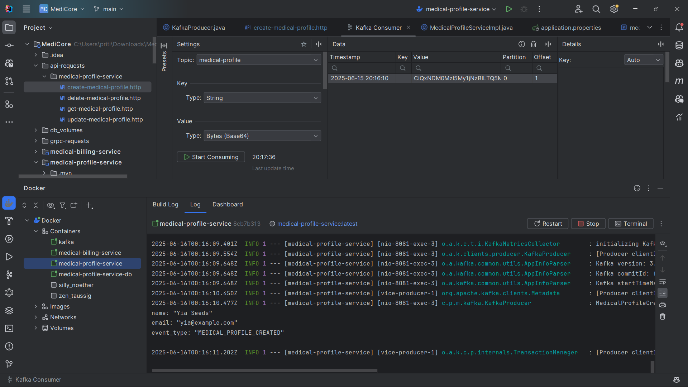
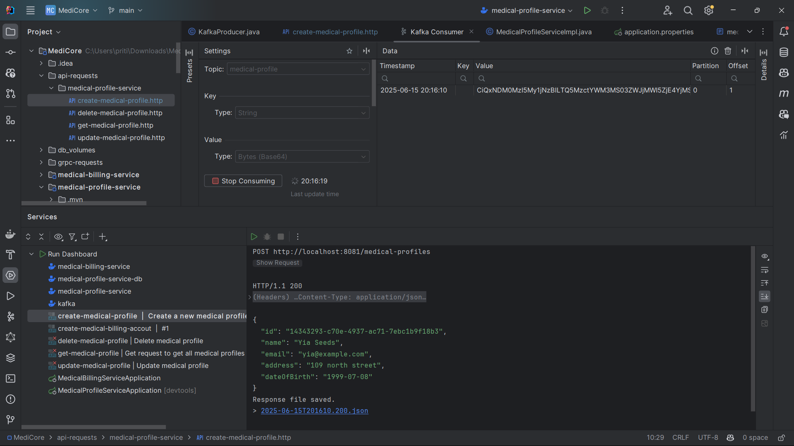
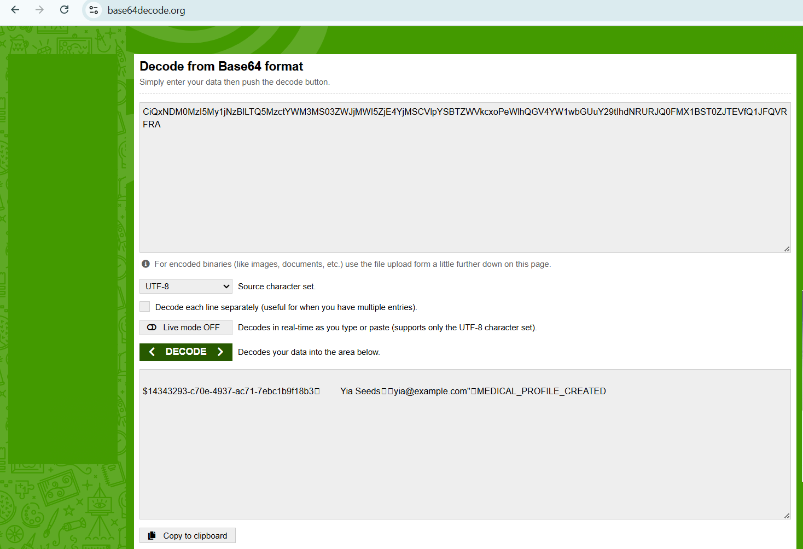


## Kafka Consumer Implementation

The `medical-analytics-service` acts as a Kafka **consumer**, responsible for asynchronously receiving and processing medical profile creation events published by the `medical-profile-service`. This service listens to the Kafka topic `medical-profile` and consumes serialized `MedicalProfileEvent` messages (encoded in Protocol Buffers).

| Property            | Value                                     |
| ------------------- | ----------------------------------------- |
| **Service**         | `medical-analytics-service`               |
| **Kafka Topic**     | `medical-profile`                         |
| **Group ID**        | `medical-analytics-service`               |
| **Deserialization** | `ByteArrayDeserializer` + Protobuf Parser |
| **Message Type**    | `MedicalProfileEvent`                     |

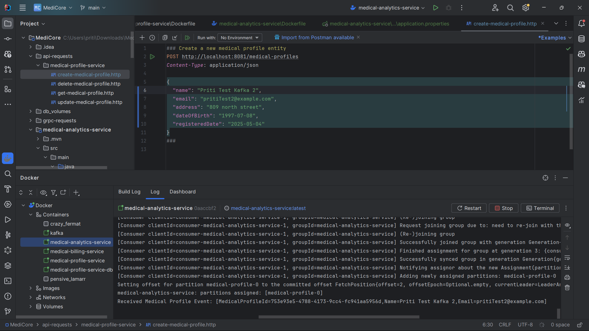
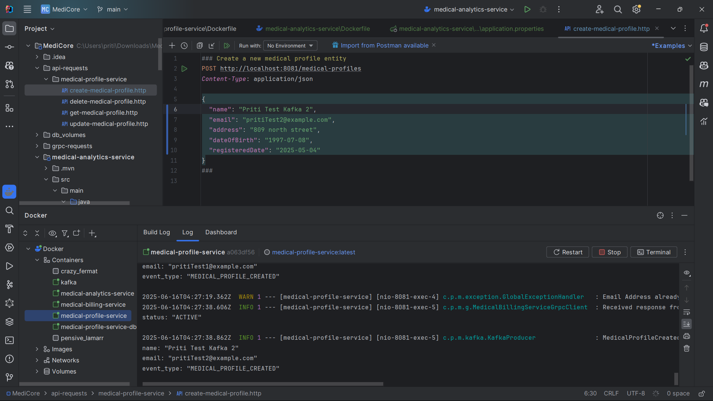

Please refer to [Medical Analytics Service](#medical-analytics-service) for complete detail.


## Development Notes / Change Log

- Added DTOs for request and response
- Developed create, update, get, delete logic in service and controller
- Implemented grouped validation
- Added custom repository methods to prevent duplicate emails
- Introduced global error handler to handle exceptions gracefully
- Verified all endpoints using `.http` request files
- Integrated SpringDoc for OpenAPI documentation
- Dockerized the application with a multi-stage Dockerfile
- Created and configured PostgreSQL container with internal Docker networking
- Connected Dockerized Spring Boot app to PostgreSQL using environment variables
- Verified DB connection via IntelliJ and tested all API endpoints in the Dockerized setup
- Implemented gRPC client to call remote billing service
- Integrated `.proto` file and compiled client stubs using Maven
- Automatically creates a billing account when a profile is created
- Configured gRPC server connection via externalized `application.properties`
- Introduced Kafka for asynchronous event-driven communication
- Created MedicalProfileKafkaProducer to publish profile creation events to Kafka
- Defined Protobuf schema for MedicalProfileCreated events and compiled using Maven plugin
- Configured Kafka producer with key/value serializers in application.properties
- Added SPRING_KAFKA_BOOTSTRAP_SERVERS to Docker environment for internal Kafka discovery
- Tested event flow using IntelliJ Kafka consumer – verified binary message contents after decoding

---

## Medical Billing Service

The `medical-billing-service` is a gRPC-based microservice in the MediCore ecosystem responsible for handling billing account operations. It exposes gRPC endpoints for other services (like `medical-profile-service`) to create and manage medical billing accounts. This service is designed using Spring Boot 3.5.0 and Java 21, and communicates using Protocol Buffers over gRPC.


## Table of Contents

- [Features Billing Service](#features-billing-service)
- [Tech Stack Billing Service](#tech-stack-billing-service)
- [Proto Definition](#proto-definition)
- [gRPC Server Implementation](#grpc-server-implementation)
- [Running the Service](#running-the-service)
- [Docker Support](#docker-support)
- [Testing gRPC Requests](#testing-grpc-requests)
- [Service-to-Service Communication](#service-to-service-communication)
- [Development Notes](#development-notes)

## Features Billing Service

- Exposes a gRPC endpoint to create a billing account.
- Can be invoked by client services using Protocol Buffers.
- Logs incoming gRPC requests.
- Returns mock responses (to be replaced with real logic).
- Built with modular, scalable microservice architecture in mind.


## Tech Stack Billing Service

| Layer            | Technology                          |
|------------------|--------------------------------------|
| Language         | Java 21                              |
| Framework        | Spring Boot 3.5.0                    |
| RPC Protocol     | gRPC                                 |
| Proto Compiler   | Protobuf 3.25.5                      |
| Build Tool       | Maven                                |
| gRPC Java Plugin | `protoc-gen-grpc-java` v1.68.1       |
| Logging          | SLF4J (Simple Logging Facade for Java) |


## Proto Definition

The gRPC service and message contracts are defined in:

```
src/main/proto/medical_billing_service.proto
```

### Sample Excerpt:

```proto
service MedicalBillingService {
  rpc CreateMedicalBillingAccount(MedicalBillingRequest) returns (MedicalBillingResponse);
}
```

### Options Used

```proto
option java_multiple_files = true;
option java_package = "billing";
```


## gRPC Server Implementation

The service class is implemented in:

```
src/main/java/com/priti/medicalbillingservice/grpc/MedicalBillingGrpcService.java
```

It extends the generated `MedicalBillingServiceImplBase` and handles incoming RPCs.

### Key Points:

- Annotated with `@GrpcService` (from grpc-spring-boot-starter).
- Logs the incoming request.
- Extends the auto-generated base class from the compiled proto
- Sends back a mock response containing an account ID and status


## Running the Service

### Prerequisites

- Java 21+
- Maven 3.8+
- Docker (optional, for DB or containerization)

### Steps

1. Compile the `.proto` definitions and generate sources:

```bash
./mvnw clean compile
```

2. Run the Spring Boot application:

```bash
./mvnw spring-boot:run
```

The gRPC server will start and listen on the configured port (default: `9001`).

> **Port Summary**:
>
> - `8082` – Spring Boot HTTP server (used for actuator or admin purposes)
> - `9001` – gRPC server port (used for service-to-service communication)

---

## Docker Support

This service can be containerized using a Dockerfile like below (example):

```dockerfile
FROM eclipse-temurin:21-jdk-alpine
WORKDIR /app
COPY target/medical-billing-service-*.jar app.jar
ENTRYPOINT ["java", "-jar", "app.jar"]
```

You can build and run the image:

```bash
docker build -t medical-billing-service .
docker run -p 9001:9001 medical-billing-service
```
If using Spring Boot actuator endpoints or HTTP admin tools, expose port `8082` as well:
>
> ```bash
> docker run -p 8082:8082 -p 9001:9001 medical-billing-service
> ```

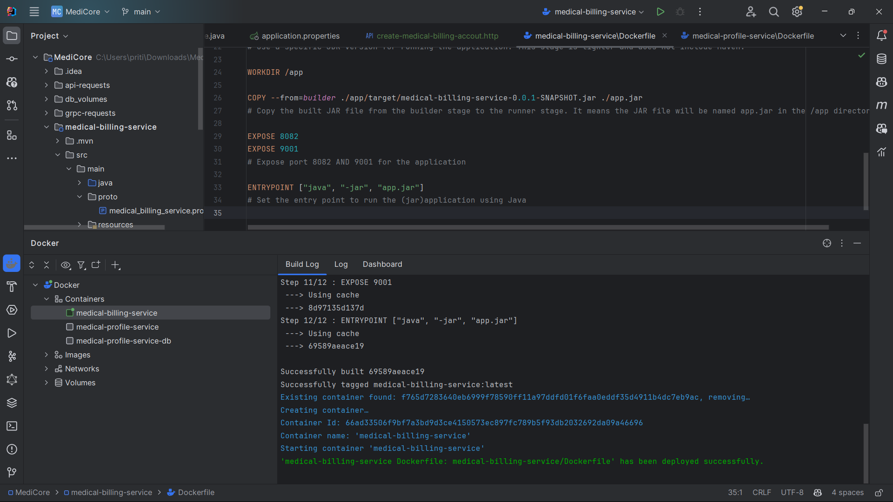


## Testing gRPC Requests

We use a custom folder structure for gRPC test requests:

```
grpc-requests/
└── medical-billing-service/
    └── Create-medical-billing-account.http
```

This `.http` file can be executed using IntelliJ IDEA or tools like `grpcurl` to simulate real client calls.

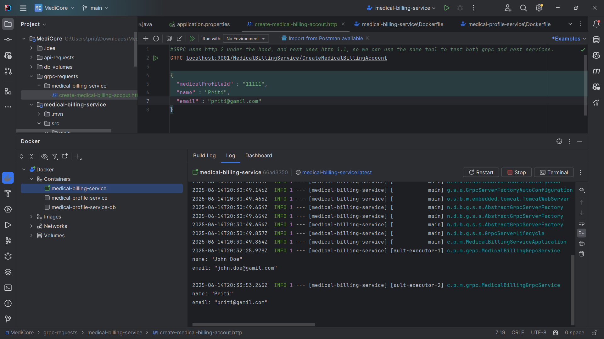


## Service-to-Service Communication

The `medical-profile-service` module acts as the gRPC client and calls the `CreateMedicalBillingAccount` RPC when a new profile is created. This validates inter-service communication using gRPC.


## Service Integration

### gRPC Client: `medical-profile-service`

This service is consumed by `medical-profile-service`, which acts as a gRPC client and calls `CreateMedicalBillingAccount` when a medical profile is created.

#### Integration Workflow:

1. A REST API call to `medical-profile-service` creates a new medical profile.
2. Internally, it triggers a gRPC request to `medical-billing-service`.
3. The billing service responds with a generated account ID and status.

#### Shared Proto File:

The `.proto` file is manually copied between both services under `src/main/proto/` to keep them in sync.

## Development Notes

- Proto files are manually copied across services for now.
- All proto compilation is handled by `protobuf-maven-plugin` configured in `pom.xml`.
- Proto classes are generated in the `target/generated-sources` directory.
- Business logic is not implemented yet; only structure and connectivity are in place.

---

## Medical Analytics Service

The `medical-analytics-service` is a dedicated microservice within the **MediCore** ecosystem, designed to consume real-time Kafka events for analytics and insights. It listens to profile creation events emitted by the `medical-profile-service` and processes them asynchronously, allowing the platform to scale efficiently and decouple compute-intensive operations from synchronous workflows.


## Table of Contents
- [Overview](#overview)
- [Purpose](#purpose)
- [Architectural Role](#architectural-role)
- [Tech Stack Analytics Service](#tech-stack-analytics-service)
- [Getting Started Analytics Service](#getting-started-analytics-service)
- [Project Structure Highlights](#project-structure-highlights)
- [Configuration Analytics Service](#configuration-analytics-service)
- [Development Notes / Change Log Analytics Service](#development-notes--change-log-analytics-service)
- [Kafka Topic and Protobuf Schema](#kafka-topic-and-protobuf-schema)
- [Summary](#summary)

## Overview

| Feature                  | Description                                                       |
| ------------------------ | ----------------------------------------------------------------- |
| **Architecture Pattern** | Event-Driven Microservice                                         |
| **Message Broker**       | Apache Kafka (using Bitnami image in KRaft mode)                  |
| **Message Format**       | Protocol Buffers (Protobuf v3)                                    |
| **Consumer Type**        | ByteArrayDeserializer → `MedicalProfileEvent.parseFrom()`         |
| **Integration**          | Connected via internal Docker network and uses shared Kafka topic |
| **Deployment Target**    | Dockerized microservice (multi-stage build with Maven & JDK 21)   |
| **Port**                 | `8083`                                                            |
| **Topic Subscribed**     | `medical-profile`                                                 |
| **Kafka Group ID**       | `medical-analytics-service`                                       |


## Purpose

The main responsibility of this service is to **consume and process `MedicalProfileEvent` messages** asynchronously, without adding latency to upstream services like `medical-profile-service`. Typical use cases include:

* **Analytics Collection**: Tracking usage patterns, profile creation metrics, and geographical insights.
* **Downstream Aggregation**: Preparing datasets for BI tools, reporting engines, or machine learning models.
* **Extensibility**: Enabling future real-time pipelines (e.g., Flink, Spark Streaming) without modifying the publisher.


## Architectural Role

This microservice participates in the MediCore event-driven architecture by subscribing to Kafka topics produced by other microservices:

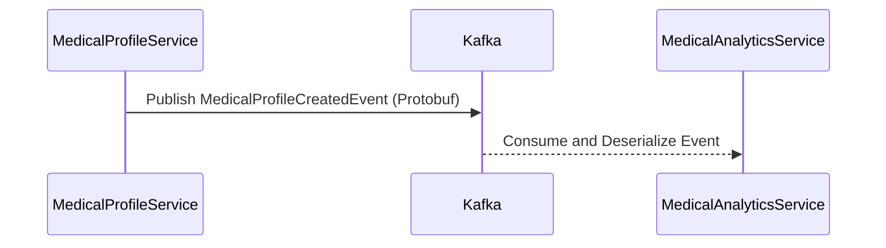
```mermaid
sequenceDiagram
    participant MedicalProfileService
    participant Kafka
    participant MedicalAnalyticsService

    MedicalProfileService->>Kafka: Publish MedicalProfileCreatedEvent (Protobuf)
    Kafka-->>MedicalAnalyticsService: Consume and Deserialize Event
```


## Tech Stack Analytics Service

* **Spring Boot** 3.x
* **Apache Kafka** (via `spring-kafka`)
* **Protobuf v3** (serialized messages)
* **Docker** (multi-stage build)
* **Maven** (with `protobuf-maven-plugin`)
* **Kafka Listener** with byte array deserialization
* **Internal Docker Networking** (`--network internal`) for service discovery


## Getting Started Analytics Service

### Prerequisites

Before running this service, ensure the following are already up:

* Docker-based Kafka broker container (port `9092`)
* Kafka topic `medical-profile` is created
* Other dependent services (`medical-profile-service`, etc.) are running if you want to simulate event flow
* Maven is available for local build (if not using Docker image)


### Run with Docker Analytics Service

Build and run this service via Docker as follows:

```bash
docker build -t medical-analytics-service .
```

```bash
docker run --name medical-analytics-service \
  --network internal \
  -p 8083:8083 \
  -e SPRING_KAFKA_BOOTSTRAP_SERVERS=kafka:9092 \
  medical-analytics-service:latest
```

**Note**: `--network internal` ensures communication between Kafka and this service


### Testing the End-to-End Flow

1. Use the HTTP POST endpoint in `medical-profile-service` to create a new profile.
2. That service publishes a `MedicalProfileEvent` to Kafka topic `medical-profile`.
3. This service consumes the event asynchronously and logs the payload.

Sample logs:

```
Received Medical Profile Event: [MedicalProfileId=ff002d9c, Name=Alice, Email=alice@example.com]
```


## Project Structure Highlights

| Path                                         | Purpose                                                                |
| -------------------------------------------- | ---------------------------------------------------------------------- |
| `src/main/proto/medical_profile_event.proto` | Defines Protobuf message schema used by both publisher/consumer        |
| `KafkaConsumer.java`                         | Kafka listener that consumes and deserializes Protobuf events          |
| `application.properties`                     | Kafka consumer configuration (port, deserializer, etc.)                |
| `Dockerfile`                                 | Multi-stage Docker setup with Maven + JDK 21 runtime                   |
| `pom.xml`                                    | Includes `spring-kafka`, `protobuf-java`, and protobuf compiler plugin |


## Configuration Analytics Service

Configuration is managed via `application.properties` and environment variables:

| Property                                   | Purpose                                             |
| ------------------------------------------ | --------------------------------------------------- |
| `spring.kafka.bootstrap-servers`           | Injected via environment (`kafka:9092` in Docker)   |
| `spring.kafka.consumer.group-id`           | `medical-analytics-service` (for consumer grouping) |
| `spring.kafka.consumer.key-deserializer`   | String deserializer                                 |
| `spring.kafka.consumer.value-deserializer` | Byte array (Protobuf binary data)                   |
| `server.port`                              | 8083                                                |

You can override any of these via Docker `-e` flags or IntelliJ’s run config.


## Development Notes / Change Log Analytics Service

* Created a standalone Spring Boot module `medical-analytics-service`
* Added dependencies: `spring-kafka`, `protobuf-java`, test utilities
* Compiled `medical_profile_event.proto` using `protobuf-maven-plugin`
* Implemented Protobuf deserialization logic in Kafka listener
* Logged received profile events for observability and further processing
* Dockerized the application using multi-stage Maven-JDK setup
* Successfully verified end-to-end Kafka consumption from Dockerized publisher
* Integrated into Docker internal network for seamless communication


## Kafka Topic and Protobuf Schema

**Topic Subscribed**: `medical-profile`
**Message Format**: `MedicalProfileEvent` (Protobuf v3)

```protobuf
message MedicalProfileEvent {
  string medicalProfileId = 1;
  string name = 2;
  string email = 3;
  string event_type = 4;
}
```

This schema is shared with the `medical-profile-service` and version-controlled under `src/main/proto`.


## Summary

The `medical-analytics-service` enhances the MediCore platform's responsiveness, scalability, and extensibility by processing events in a non-blocking, real-time manner. Its decoupled design allows future evolution — such as integrating with BI tools or machine learning pipelines — without impacting upstream services.

---

## API Gateway

As of now, our client application interacts **directly** with individual microservices (e.g., `medical-profile-service`). While this works for small setups, it quickly becomes **unmanageable, insecure, and inflexible** as the number of microservices increases. This is where an **API Gateway** becomes essential.

## Table of Contents
- [API Gateway Tech Stack](#api-gateway-tech-stack)
- [Problems with Direct Client-to-Microservice Communication](#problems-with-direct-client-to-microservice-communication)
- [Enter API Gateway](#enter-api-gateway)
- [Real-World Scenario in MediCore](#real-world-scenario-in-medicore)
- [Configured Routes (as of now)](#configured-routes-as-of-now)
- [API Gateway Docker Integration](#api-gateway-docker-integration)
- [Authentication via Gateway](#authentication-via-gateway)
- [Implementation with Spring Cloud Gateway](#implementation-with-spring-cloud-gateway)
- [Testing the API Gateway](#testing-the-api-gateway)
- [API Gateway Summary](#api-gateway-summary)

## API Gateway Tech Stack

* **Java 21**
* **Spring Boot 3**
* **Spring Cloud Gateway (Reactive)**
* **Maven**
* **Docker**


## Problems with Direct Client-to-Microservice Communication

1. **Tight Coupling to Service Addresses**
   Clients must know the **exact address (host\:port)** of each microservice.

  * Any change (e.g., port update, service renaming) requires **manual updates** in all clients.
  * Increases risk of misconfiguration and versioning conflicts.

2. **Security Exposure**
   Services like `medical-profile-service` must expose ports (e.g., `8081`) **publicly**.

  * Makes services vulnerable to **unauthorized access** or **attacks** from the internet.

3. **Scalability Challenges**
   Every time we introduce a new microservice (e.g., `medical-analytics-service`),

  * All clients need to **update configurations** again.
  * Complexity grows **exponentially** with the number of services.

4. **No Centralized Control**

  * No unified layer for **logging**, **authentication**, **rate limiting**, or **monitoring**.
  * Increases **inconsistency** and **duplicated effort** across services.


## Enter API Gateway

An **API Gateway** is a single entry point for all client requests. It acts as a **reverse proxy** that routes incoming traffic to the appropriate microservice internally.

### Core Responsibilities

* **Request Routing**
  Routes incoming HTTP requests to the correct downstream service based on URL patterns or headers.

* **Service Abstraction**
  Clients only talk to the gateway. Internal service details (IP, port, protocols) are **hidden**.

* **Security Layer**
  Only the gateway is exposed externally. All internal services are shielded from direct traffic.

* **Centralized Cross-Cutting Concerns**
  Enables consistent handling of:

  * Authentication & Authorization
  * Logging
  * Request throttling / rate limiting
  * Caching
  * Monitoring / metrics


### Benefits of Using an API Gateway

| Feature              | Without API Gateway             | With API Gateway                  |
| -------------------- | ------------------------------- | --------------------------------- |
| Service discovery    | Manual address config           | Dynamic / abstracted              |
| Scalability          | Client updates for each service | Centralized routing               |
| Security             | Each service exposed            | Only gateway exposed              |
| Cross-cutting logic  | Duplicated in every service     | Centralized once                  |
| Auth & Authorization | Each service handles it         | Gateway + auth service handles it |
| Port exposure        | Each service opens a port       | Only gateway does                 |


## Real-World Scenario in MediCore

### Current Flow (Without Gateway):

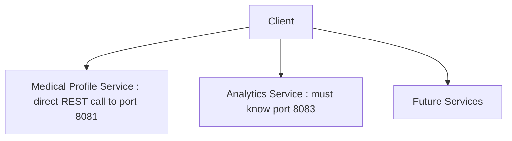
```mermaid
graph TD
Client --> MedicalProfile[Medical Profile Service : direct REST call to port 8081]
Client --> Analytics[Analytics Service : must know port 8083]
Client --> FutureServices[Future Services]
```

* Client must manage **multiple base URLs**
* If a port or host changes → client config **breaks**
* Security and maintainability issues increase

### Improved Flow (With API Gateway):

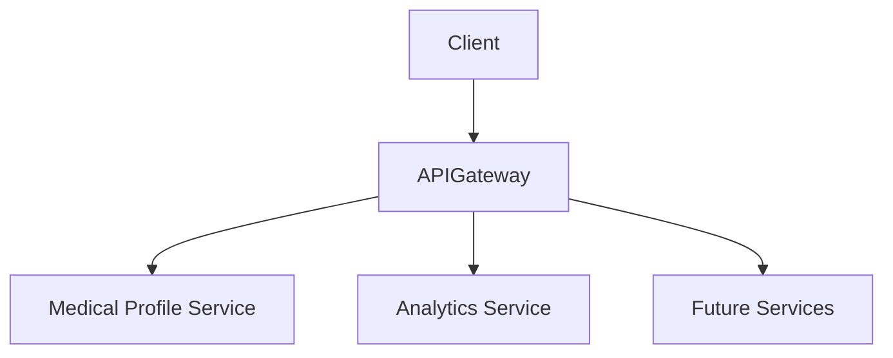
```mermaid
graph TD
  Client --> APIGateway
  APIGateway --> MedicalProfile[Medical Profile Service]
  APIGateway --> Analytics[Analytics Service]
  APIGateway --> FutureServices[Future Services]
```
 

* Client only needs to know: `http://api.medicore.com` (or similar)
* API Gateway handles all **internal routing logic**
* We gain **security**, **flexibility**, and **future-proofing**

## Configured Routes (as of now)

| Route                        | Proxies To                                     |
| ---------------------------- | ---------------------------------------------- |
| `/api/medical-profiles/**`   | `medical-profile-service:/medical-profiles/**` |
| `/api-docs/medical-profiles` | `medical-profile-service:/v3/api-docs`         |


## API Gateway Docker Integration

The `api-gateway` is fully Dockerized and runs inside the **shared internal Docker network** of the MediCore system. This enables seamless service-to-service communication using container names as hostnames.

* Port **`8084`** is exposed externally for the gateway.
* Other internal services (e.g., `medical-profile-service`) are **no longer exposed** directly to the outside world.
* Docker `--network=internal` ensures proper DNS resolution for service discovery.


## Authentication via Gateway

(In progress) The gateway will **delegate authentication/authorization** to a dedicated **Auth Service**.

Example Flow:

1. Client sends a request to create a medical profile
2. API Gateway intercepts it
3. Gateway calls Auth Service to validate the token/permissions
4. If valid → forwards request to `medical-profile-service`
5. If not → rejects the request

This ensures that all services behind the gateway are **protected** without needing to implement auth logic in each microservice.


## Implementation with Spring Cloud Gateway

We implemented the API gateway using **Spring Cloud Gateway**, a powerful, lightweight routing library built on top of Spring WebFlux.

Benefits of Spring Cloud Gateway:

* Easy configuration via YAML or Java DSL
* Seamless Spring Boot integration
* Reactive, non-blocking architecture (WebFlux)
* Flexible route predicates and filters(Supports filters for pre/post processing)
* Works well with Spring Security and OAuth2
* Out-of-the-box support for:
  * StripPrefix, RewritePath, Circuit Breakers
  * Rate limiting, request logging
  * Path-based routing and header manipulation

Routing rules are configured declaratively via `application.yml`.

## Testing the API Gateway

Once all services are running in the shared Docker network, you can test the API Gateway using any REST client (e.g., Postman, IntelliJ HTTP requests, curl).

### Verify Route Forwarding

Make sure these service's containers are running:

* `api-gateway` (exposes `8084`)
* `medical-profile-service` (internal only on Docker network)
* `medical-profile-service-db`


### Example: List All Medical Profiles

```http
GET http://localhost:8084/api/medical-profiles
```

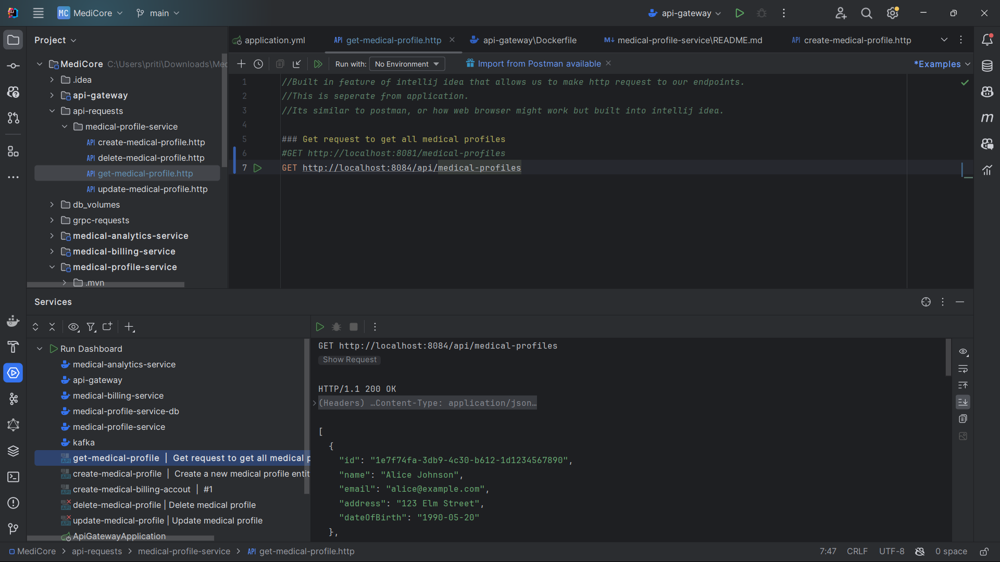

Under the hood:

* API Gateway receives the request on `/api/medical-profiles`
* It strips the `/api` prefix
* Internally routes to `http://medical-profile-service:8081/medical-profiles`


### Testing Swagger API Docs via Gateway


This confirms that API Gateway is successfully forwarding to internal documentation endpoints too.

## API Gateway Summary

| Without Gateway                        | With Gateway                 |
| -------------------------------------- | ---------------------------- |
| Direct service-to-client communication | Centralized entry point      |
| Exposed ports for each service         | One secure, exposed port     |
| Manual updates for service discovery   | Dynamic routing              |
| Duplicated security logic              | Unified authentication layer |
| Poor scalability                       | Seamless service growth      |

The API Gateway becomes the **front door** of our system — enabling clean separation, centralized control, and production-ready architecture.

---

## Auth Service

The auth-service is a core microservice in the MediCore system responsible for handling user authentication and authorization across all downstream services. It issues JWT tokens after validating user credentials, enabling secure, stateless access to protected endpoints through the API Gateway. This service acts as the **security backbone** of the platform, ensuring only authenticated clients can access protected resources.

---

## Table of Contents
- [Securing Microservices with JWT Authentication](#securing-microservices-with-jwt-authentication)
- [Auth Service Tech Stack](#auth-service-tech-stack)
- [Auth Service Features Implemented](#auth-service-features-implemented)
- [Auth Service Database Setup](#auth-service-database-setup)
- [Auth Service Docker Integration](#auth-service-docker-integration)
- [Auth Service Security Configuration](#auth-service-security-configuration)
- [Auth Service Conclusion](#auth-service-conclusion)

---

## Securing Microservices with JWT Authentication

With the **API Gateway** now acting as the central entry point to our microservices architecture, the next critical step is to integrate a robust **authentication and authorization** mechanism. This will ensure that our services are **not publicly accessible** to unauthorized users and follow **secure, token-based access control**.

### Current Limitation

Until now, services like `medical-profile-service` were **openly accessible** from the internet, which poses significant **security risks** in production environments. Any client could make unauthenticated requests directly to sensitive endpoints.


### What We're Building

To mitigate this, we're introducing a **dedicated Authentication Service** that will manage user identities and issue **JSON Web Tokens (JWTs)**. This approach enables **stateless, secure communication** across our distributed system.


### Purpose & Motivation

As MediCore evolves into a modular, scalable ecosystem of services, ensuring secure access control becomes critical. Initially, services like `medical-profile-service` were publicly accessible — a major security risk. The `auth-service` addresses this by:

- Validating user credentials (email & password)
- Issuing signed JWT tokens on successful login
- Enabling downstream services to trust requests routed through the gateway


### Securing Access via Gateway

Once a client receives a valid JWT, all subsequent requests to protected endpoints (e.g., `/api/medical-profiles`) must include this token in the `Authorization` header:

```http
Authorization: Bearer <JWT_TOKEN>
```

### End-to-End Request Flow with JWT

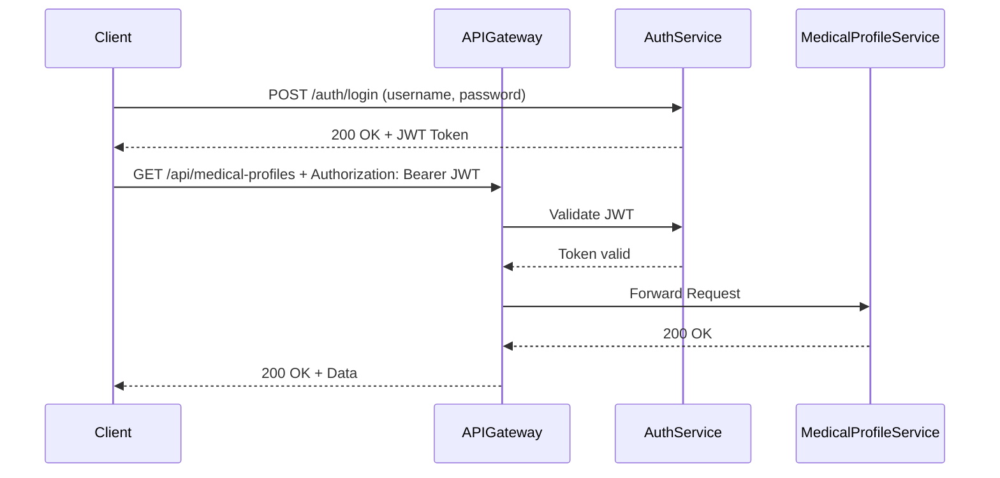
```mermaid
sequenceDiagram
    participant Client
    participant APIGateway
    participant AuthService
    participant MedicalProfileService

    Client->>AuthService: POST /auth/login (username, password)
    AuthService-->>Client: 200 OK + JWT Token

    Client->>APIGateway: GET /api/medical-profiles + Authorization: Bearer JWT
    APIGateway->>AuthService: Validate JWT
    AuthService-->>APIGateway: Token valid
    APIGateway->>MedicalProfileService: Forward Request
    MedicalProfileService-->>APIGateway: 200 OK
    APIGateway-->>Client: 200 OK + Data
```

If the JWT is invalid or expired:

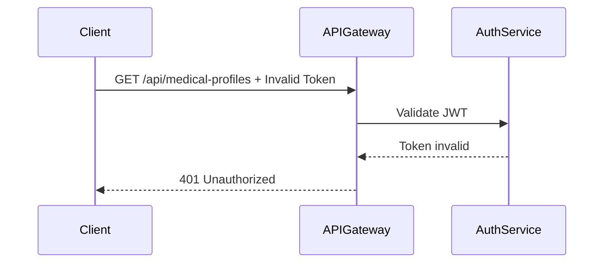
```mermaid
sequenceDiagram
    Client->>APIGateway: GET /api/medical-profiles + Invalid Token
    APIGateway->>AuthService: Validate JWT
    AuthService-->>APIGateway: Token invalid
    APIGateway-->>Client: 401 Unauthorized
```

### Why This Matters

This architecture:

* **Secures All Downstream Services** — No direct access to any microservice without a valid token
* **Centralizes Authentication Logic** — Gateway and Auth service control all access points
* **Scales Effortlessly** — New services can be protected by updating gateway rules only
* **Stateless Security** — No session management needed, thanks to JWT

---


## Auth Service Tech Stack

- **Java 21**
- **Spring Boot 3**, **Maven**
- **Spring Security** (Stateless mode)
- **Spring Data JPA (Hibernate)**
- **PostgreSQL** (Docker container)
- **jjwt** (Java JWT library)
- **Dockerized Deployment** with multistage build
- **SpringDoc OpenAPI UI** for testing endpoints
- **BCrypt** for password hashing

---

## Auth Service Features Implemented

### User Authentication

- Verifies user credentials stored in a PostgreSQL database
- Uses `BCryptPasswordEncoder` for password hashing and validation
- Provides a clean, layered architecture: `DTO → Controller → Service → Repository`

### JWT Token Issuance

- Generates signed JWTs with embedded claims (`email`, `role`)
- Uses secret key stored in environment variable (`JWT_SECRET`)
- Tokens are valid for 10 hours and used for stateless authorization

### DTOs and Validation

- `LoginRequestDTO`: Validates login payload using annotations
- `LoginResponseDTO`: Encapsulates the issued JWT token

### Stateless Login Endpoint

- `POST /login` authenticates users and returns token
- Returns `401 Unauthorized` if credentials are invalid
- Uses `Optional<String>` chaining for clean, functional logic

### Testing and Verification

- HTTP requests tested locally via IntelliJ and Postman

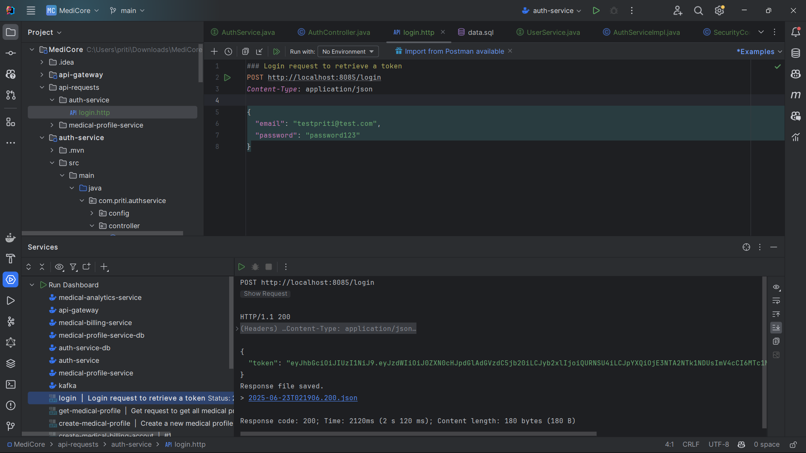


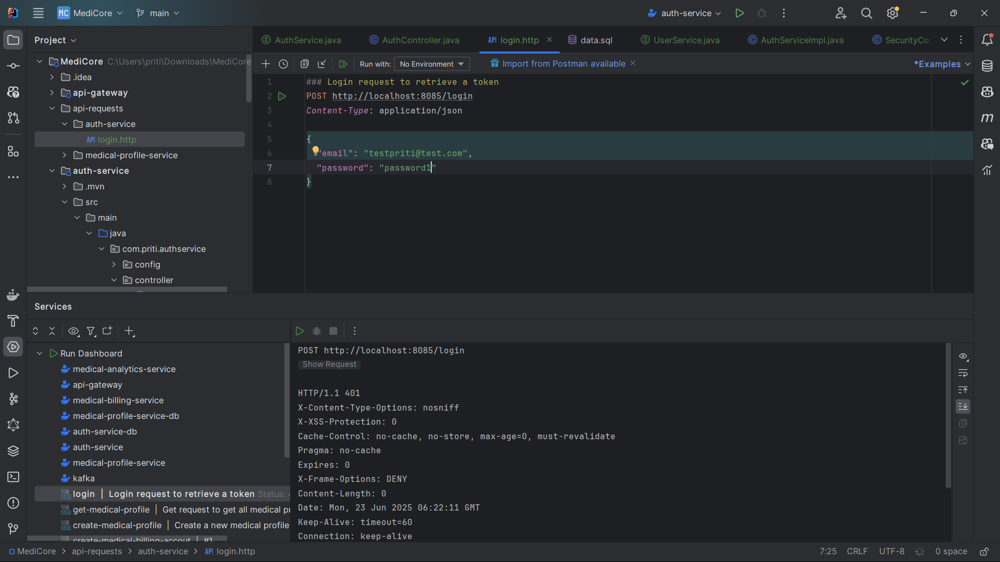

---

## Auth Service Database Setup

- PostgreSQL container: `auth-service-db`
- Port: `5001:5432` (local development)
- Volume mounted for persistence
- Admin user seeded via `data.sql`:
  - Email: `testpriti@test.com`
  - Password: `password` (BCrypt-hashed)

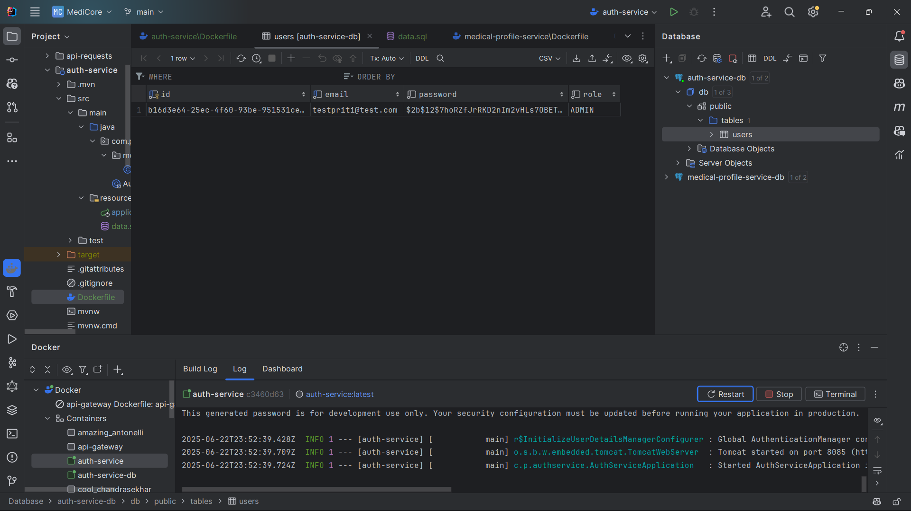

---


## Auth Service Docker Integration

- Exposed port: `8085` (for development only)
- Docker image built via multistage Dockerfile
- Environment variables passed via Docker run configuration:
  - `SPRING_DATASOURCE_URL`
  - `SPRING_DATASOURCE_USERNAME`
  - `SPRING_DATASOURCE_PASSWORD`
  - `SPRING_JPA_HIBERNATE_DDL_AUTO`
  - `SPRING_SQL_INIT_MODE`
  - `JWT_SECRET`
- Connected to `internal` Docker network for inter-service communication

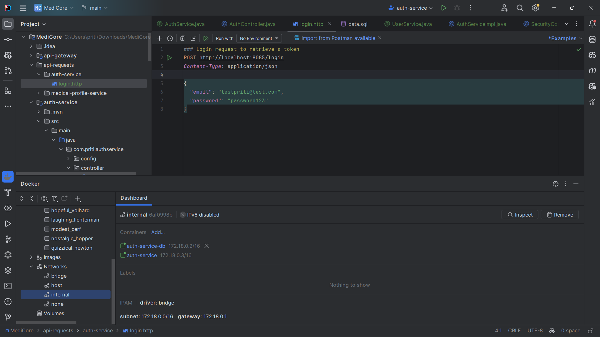

---

## Auth Service Security Configuration

- Stateless, CSRF disabled (API Gateway handles external validation)
- All requests are permitted at auth-service level (trusted traffic from gateway only)
- Spring Security filter chain customized
- Separation of concerns: AuthService validates tokens, downstream services remain clean

---

## Auth Service Conclusion

This section demonstrates:

* Real-world implementation of **microservice authentication patterns**
* Proficiency in **Spring Boot**, **JWT**, and **API Gateway** security
* Dockerized, scalable service design that follows **DevOps-ready** practices
* Preparedness for **deployment** with centralized auth and routing
* Stateless token issuance and centralized validation via gateway

---


