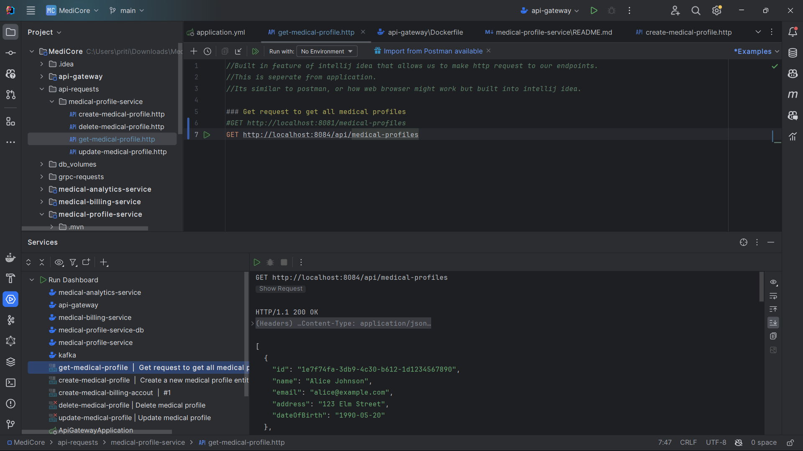
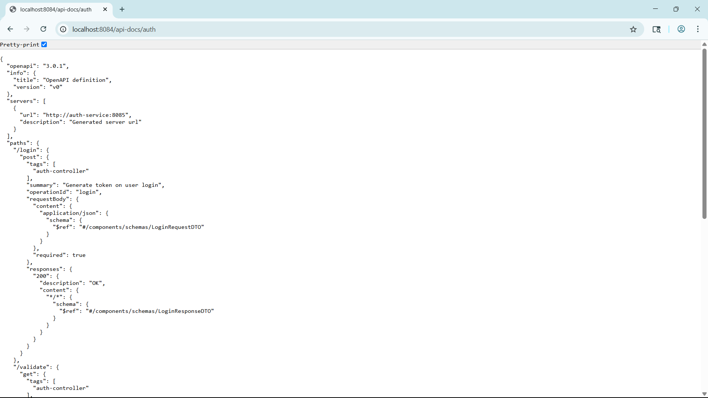

# API Gateway

As of now, our client application interacts **directly** with individual microservices (e.g., `medical-profile-service`). While this works for small setups, it quickly becomes **unmanageable, insecure, and inflexible** as the number of microservices increases. This is where an **API Gateway** becomes essential.

---

## Table of Contents
- [Tech Stack](#tech-stack)
- [Problems with Direct Client-to-Microservice Communication](#problems-with-direct-client-to-microservice-communication)
- [Enter API Gateway](#enter-api-gateway)
- [Benefits of Using an API Gateway](#benefits-of-using-an-api-gateway)
- [Real-World Scenario in MediCore](#real-world-scenario-in-medicore)
- [Configured Routes (as of now)](#configured-routes-as-of-now)
- [API Gateway Docker Integration](#api-gateway-docker-integration)
- [Securing Auth Service Behind API Gateway](#securing-auth-service-behind-api-gateway)
- [Authentication via Gateway](#authentication-via-gateway)
- [Implementation with Spring Cloud Gateway](#implementation-with-spring-cloud-gateway)
- [Testing the API Gateway](#testing-the-api-gateway)
- [Summary](#summary)

## Tech Stack

* **Java 21**
* **Spring Boot 3**
* **Spring Cloud Gateway (Reactive)**
* **Maven**
* **Docker**

---

## Problems with Direct Client-to-Microservice Communication

1. **Tight Coupling to Service Addresses**
   Clients must know the **exact address (host\:port)** of each microservice.

* Any change (e.g., port update, service renaming) requires **manual updates** in all clients.
* Increases risk of misconfiguration and versioning conflicts.

2. **Security Exposure**
   Services like `medical-profile-service` must expose ports (e.g., `8081`) **publicly**.

* Makes services vulnerable to **unauthorized access** or **attacks** from the internet.

3. **Scalability Challenges**
   Every time we introduce a new microservice (e.g., `medical-analytics-service`),

* All clients need to **update configurations** again.
* Complexity grows **exponentially** with the number of services.

4. **No Centralized Control**

* No unified layer for **logging**, **authentication**, **rate limiting**, or **monitoring**.
* Increases **inconsistency** and **duplicated effort** across services.

---

## Enter API Gateway

An **API Gateway** is a single entry point for all client requests. It acts as a **reverse proxy** that routes incoming traffic to the appropriate microservice internally.

### Core Responsibilities

* **Request Routing**
  Routes incoming HTTP requests to the correct downstream service based on URL patterns or headers.

* **Service Abstraction**
  Clients only talk to the gateway. Internal service details (IP, port, protocols) are **hidden**.

* **Security Layer**
  Only the gateway is exposed externally. All internal services are shielded from direct traffic.

* **Centralized Cross-Cutting Concerns**
  Enables consistent handling of:

    * Authentication & Authorization
    * Logging
    * Request throttling / rate limiting
    * Caching
    * Monitoring / metrics
---

### Benefits of Using an API Gateway

| Feature              | Without API Gateway             | With API Gateway                  |
| -------------------- | ------------------------------- | --------------------------------- |
| Service discovery    | Manual address config           | Dynamic / abstracted              |
| Scalability          | Client updates for each service | Centralized routing               |
| Security             | Each service exposed            | Only gateway exposed              |
| Cross-cutting logic  | Duplicated in every service     | Centralized once                  |
| Auth & Authorization | Each service handles it         | Gateway + auth service handles it |
| Port exposure        | Each service opens a port       | Only gateway does                 |

---

## Real-World Scenario in MediCore

#### Current Flow (Without Gateway):


* Client must manage **multiple base URLs**
* If a port or host changes → client config **breaks**
* Security and maintainability issues increase

#### Improved Flow (With API Gateway):


* Client only needs to know: `http://api.medicore.com` (or similar)
* API Gateway handles all **internal routing logic**
* We gain **security**, **flexibility**, and **future-proofing**

---

## Configured Routes (as of now)

| Route                        | Proxies To                                     |
|------------------------------|------------------------------------------------|
| `/api/medical-profiles/**`   | `medical-profile-service:/medical-profiles/**` |
| `/api-docs/medical-profiles` | `medical-profile-service:/v3/api-docs`         |
| `/auth/**`                   | `auth-service:/`                               |
| `/api-docs/auth`             | `auth-servicee:/v3/api-docs`                   |

---

## API Gateway Docker Integration

The `api-gateway` is fully Dockerized and runs inside the **shared internal Docker network** of the MediCore system. This enables seamless service-to-service communication using container names as hostnames.

* Port **`8084`** is exposed externally for the gateway.
* Other internal services (e.g., `medical-profile-service`) are **no longer exposed** directly to the outside world.
* Docker `--network=internal` ensures proper DNS resolution for service discovery.

---

## Securing Auth Service Behind API Gateway

To strengthen the system's security posture and simplify external communication, the `auth-service` is now fully routed through the **API Gateway**. This means:

* All authentication operations must go through the gateway (`/auth/login`, `/auth/validate`)
* The `auth-service` is **no longer exposed** to the internet — only available via internal Docker networking
* Ensures all traffic is **centrally logged, validated, and controlled**

### Updated Architecture Diagram


### Example Gateway Routing Behavior

| External Request     | Internally Routed To     |
| -------------------- | ------------------------ |
| `POST /auth/login`   | `auth-service:/login`    |
| `GET /auth/validate` | `auth-service:/validate` |

---

### Tested Behavior

* `POST /auth/login` through the gateway successfully returns a signed JWT.
* `GET /auth/validate` through the gateway validates the JWT and returns `200 OK` or `401 Unauthorized`.
* The `auth-service` container **no longer exposes any ports** externally. All calls must pass through the gateway.

### Why This Matters

| Benefit                   | Description                                                                        |
| ---------------------------- | ---------------------------------------------------------------------------------- |
| Centralized security       | Auth service is shielded from public traffic                                       |
| Cleaner client interaction | Clients only use a single URL (gateway), reducing complexity                       |
| Easier scaling             | New services can be added and routed without exposing ports or changing clients    |
| Better production hygiene  | Matches how large-scale microservices work in real-world containerized deployments |

---

## Authentication via Gateway

To secure internal microservices (like the Medical Profile Service), we integrated a robust JWT validation mechanism via a **custom global filter** in the API Gateway.

### Goals:

* Ensure only authenticated clients can access protected services
* Centralize token validation logic to keep downstream services clean
* Prevent direct client access to `auth-service` or other internal endpoints

### JWT Validation Filter Flow

All protected routes (like `/api/medical-profiles/**`) are guarded by a custom filter (`JwtValidation`) that performs the following:

1. **Intercepts** each incoming request to a protected route.
2. **Extracts** the `Authorization: Bearer <token>` header.
3. **Calls** the `/validate` endpoint of the `auth-service` using a non-blocking WebClient.
4. **Proceeds** only if the token is valid; otherwise responds with a `401 Unauthorized`.

This filter is registered declaratively in the `application.yml` of the gateway under route configuration. Unauthorized access is gracefully handled via a global `@RestControllerAdvice`.

#### How It Works – High-Level Flow

The gateway will **delegate authentication/authorization** to a dedicated **Auth Service**.


This ensures that all services behind the gateway are **protected** without needing to implement auth logic in each microservice.

### Why We Do This in the Gateway


| Without Global Filter                     | With Global JWT Filter in Gateway          |
| ----------------------------------------- | ------------------------------------------ |
| Each service must validate JWT itself     | Gateway centralizes token validation logic |
| Security logic duplicated in each service | Security logic is maintained in one place  |
| Exposes each service to possible misuse   | Gateway is the single enforcement layer    |

This is the equivalent of having a **firewall with identity enforcement** in real production architecture.


### Architecture Diagram Authentication via Gateway

[//]: # (flowchart TD)

[//]: # (subgraph External [External Clients])

[//]: # (CLIENT[Client App / REST Client])

[//]: # (end)

[//]: # ()
[//]: # (    subgraph Gateway [API Gateway: port 8084])

[//]: # (        GW)

[//]: # (    end)

[//]: # ()
[//]: # (    subgraph InternalNetwork [Docker Internal Network])

[//]: # (        AUTH[Auth Service: internal only])

[//]: # (        PROFILE[Medical Profile Service])

[//]: # (    end)

[//]: # ()
[//]: # (    CLIENT -->|POST /auth/login| GW)

[//]: # (    CLIENT -->|GET /auth/validate| GW)

[//]: # (    CLIENT -->|GET /api/medical-profiles| GW)

[//]: # ()
[//]: # (    GW -->|Forward /auth/login| AUTH)

[//]: # (    GW -->|Forward /auth/validate| AUTH)

[//]: # (    GW -->|Call /validate → then forward /medical-profiles| PROFILE)


## Route Configuration

| Route                      | Destination                                 | Description                         | Security |
| -------------------------- | ------------------------------------------- | ----------------------------------- | -------- |
| `/auth/login`              | `auth-service:/login`                       | Issues JWT token                    | Public   |
| `/auth/validate`           | `auth-service:/validate`                    | Validates token                     | Public   |
| `/api/medical-profiles/**` | `medical-profile-service:/medical-profiles` | Protected medical profile endpoints |  Yes   |


### Docker Integration for Authentication via Gateway
The API Gateway and Auth Service are both Dockerized and run in the same internal Docker network. This allows them to communicate securely without exposing the Auth Service to the public internet.
* **Auth Service**: Runs internally and is only accessible from inside the Docker network.
* **Gateway → Auth-Service**: Uses container DNS (`auth-service`) for internal validation.
* **Environment Variable**: `AUTH_SERVICE_URL` is passed to the gateway at runtime to allow the filter to locate the Auth Service.

Docker networking ensures clean inter-service communication and prevents unauthorized traffic to internal services.

---

## Implementation with Spring Cloud Gateway

We implemented the API gateway using **Spring Cloud Gateway**, a powerful, lightweight routing library built on top of Spring WebFlux.

Benefits of Spring Cloud Gateway:

* Easy configuration via YAML or Java DSL
* Seamless Spring Boot integration
* Reactive, non-blocking architecture (WebFlux)
* Flexible route predicates and filters(Supports filters for pre/post processing)
* Works well with Spring Security and OAuth2
* Out-of-the-box support for:

    * StripPrefix, RewritePath, Circuit Breakers
    * Rate limiting, request logging
    * Path-based routing and header manipulation

Routing rules are configured declaratively via `application.yml`.

---

## Testing the API Gateway

Once all services are running in the shared Docker network, you can test the API Gateway using any REST client (e.g., Postman, IntelliJ HTTP requests, curl).

### Verify Route Forwarding

Make sure these service's containers are running:

* `api-gateway` (exposes `8084`)
* `medical-profile-service` (internal only on Docker network)
* `medical-profile-service-db`
* `auth-service` (internal only on Docker network)
* `auth-service-db`


### Test: List All Medical Profiles

```http
GET http://localhost:8084/api/medical-profiles
```


Under the hood:

* API Gateway receives the request on `/api/medical-profiles`
* It strips the `/api` prefix
* Internally routes to `http://medical-profile-service:8081/medical-profiles`


### Testing Swagger API Docs via Gateway





This confirms that API Gateway is successfully forwarding to internal documentation endpoints too.

### Test: Authenticate User

```http
POST http://localhost:8084/auth/login
```


```http
POST http://localhost:8084/auth/va
```


### Test: Access Protected Route using Global JWT Filter in the gateway to validate JWTs for all protected downstream routes


Valid Token:


Invalid Token: 


This confirms that the JWT validation filter is working correctly, allowing access to protected routes only with valid tokens.

---

## Summary

| Without Gateway                        | With Gateway                 |
| -------------------------------------- | ---------------------------- |
| Direct service-to-client communication | Centralized entry point      |
| Exposed ports for each service         | One secure, exposed port     |
| Manual updates for service discovery   | Dynamic routing              |
| Duplicated security logic              | Unified authentication layer |
| Poor scalability                       | Seamless service growth      |

The API Gateway becomes the **front door** of our system — enabling clean separation, centralized control, and production-ready architecture.

---
