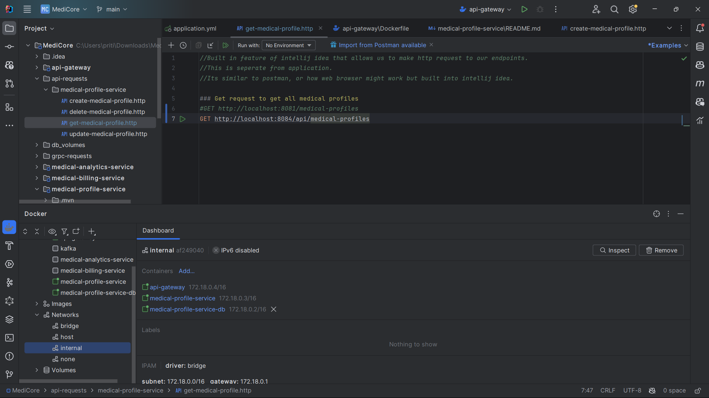
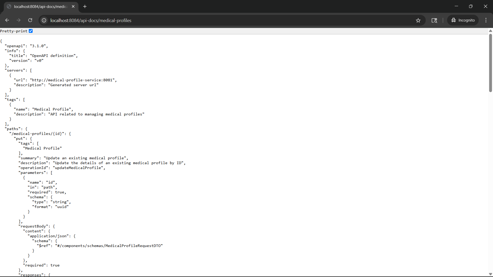

# API Gateway

As of now, our client application interacts **directly** with individual microservices (e.g., `medical-profile-service`). While this works for small setups, it quickly becomes **unmanageable, insecure, and inflexible** as the number of microservices increases. This is where an **API Gateway** becomes essential.

---

## Tech Stack

* **Java 21**
* **Spring Boot 3**
* **Spring Cloud Gateway (Reactive)**
* **Maven**
* **Docker**

---

## Problems with Direct Client-to-Microservice Communication

1. **Tight Coupling to Service Addresses**
   Clients must know the **exact address (host\:port)** of each microservice.

* Any change (e.g., port update, service renaming) requires **manual updates** in all clients.
* Increases risk of misconfiguration and versioning conflicts.

2. **Security Exposure**
   Services like `medical-profile-service` must expose ports (e.g., `8081`) **publicly**.

* Makes services vulnerable to **unauthorized access** or **attacks** from the internet.

3. **Scalability Challenges**
   Every time we introduce a new microservice (e.g., `medical-analytics-service`),

* All clients need to **update configurations** again.
* Complexity grows **exponentially** with the number of services.

4. **No Centralized Control**

* No unified layer for **logging**, **authentication**, **rate limiting**, or **monitoring**.
* Increases **inconsistency** and **duplicated effort** across services.

---

## Enter API Gateway

An **API Gateway** is a single entry point for all client requests. It acts as a **reverse proxy** that routes incoming traffic to the appropriate microservice internally.

### Core Responsibilities

* **Request Routing**
  Routes incoming HTTP requests to the correct downstream service based on URL patterns or headers.

* **Service Abstraction**
  Clients only talk to the gateway. Internal service details (IP, port, protocols) are **hidden**.

* **Security Layer**
  Only the gateway is exposed externally. All internal services are shielded from direct traffic.

* **Centralized Cross-Cutting Concerns**
  Enables consistent handling of:

    * Authentication & Authorization
    * Logging
    * Request throttling / rate limiting
    * Caching
    * Monitoring / metrics
---

### Benefits of Using an API Gateway

| Feature              | Without API Gateway             | With API Gateway                  |
| -------------------- | ------------------------------- | --------------------------------- |
| Service discovery    | Manual address config           | Dynamic / abstracted              |
| Scalability          | Client updates for each service | Centralized routing               |
| Security             | Each service exposed            | Only gateway exposed              |
| Cross-cutting logic  | Duplicated in every service     | Centralized once                  |
| Auth & Authorization | Each service handles it         | Gateway + auth service handles it |
| Port exposure        | Each service opens a port       | Only gateway does                 |

---

## Real-World Scenario in MediCore

#### Current Flow (Without Gateway):


* Client must manage **multiple base URLs**
* If a port or host changes → client config **breaks**
* Security and maintainability issues increase

#### Improved Flow (With API Gateway):


* Client only needs to know: `http://api.medicore.com` (or similar)
* API Gateway handles all **internal routing logic**
* We gain **security**, **flexibility**, and **future-proofing**

---

## Configured Routes (as of now)

| Route                        | Proxies To                                     |
| ---------------------------- | ---------------------------------------------- |
| `/api/medical-profiles/**`   | `medical-profile-service:/medical-profiles/**` |
| `/api-docs/medical-profiles` | `medical-profile-service:/v3/api-docs`         |

---

## API Gateway Docker Integration

The `api-gateway` is fully Dockerized and runs inside the **shared internal Docker network** of the MediCore system. This enables seamless service-to-service communication using container names as hostnames.

* Port **`8084`** is exposed externally for the gateway.
* Other internal services (e.g., `medical-profile-service`) are **no longer exposed** directly to the outside world.
* Docker `--network=internal` ensures proper DNS resolution for service discovery.

---

## Authentication via Gateway

(In progress) The gateway will **delegate authentication/authorization** to a dedicated **Auth Service**.

Example Flow:

1. Client sends a request to create a medical profile
2. API Gateway intercepts it
3. Gateway calls Auth Service to validate the token/permissions
4. If valid → forwards request to `medical-profile-service`
5. If not → rejects the request

This ensures that all services behind the gateway are **protected** without needing to implement auth logic in each microservice.

---

## Implementation with Spring Cloud Gateway

We implemented the API gateway using **Spring Cloud Gateway**, a powerful, lightweight routing library built on top of Spring WebFlux.

Benefits of Spring Cloud Gateway:

* Easy configuration via YAML or Java DSL
* Seamless Spring Boot integration
* Reactive, non-blocking architecture (WebFlux)
* Flexible route predicates and filters(Supports filters for pre/post processing)
* Works well with Spring Security and OAuth2
* Out-of-the-box support for:

    * StripPrefix, RewritePath, Circuit Breakers
    * Rate limiting, request logging
    * Path-based routing and header manipulation

Routing rules are configured declaratively via `application.yml`.

---

## Testing the API Gateway

Once all services are running in the shared Docker network, you can test the API Gateway using any REST client (e.g., Postman, IntelliJ HTTP requests, curl).

### Verify Route Forwarding

Make sure these service's containers are running:

* `api-gateway` (exposes `8084`)
* `medical-profile-service` (internal only on Docker network)
* `medical-profile-service-db`



### Example: List All Medical Profiles

```http
GET http://localhost:8084/api/medical-profiles
```


Under the hood:

* API Gateway receives the request on `/api/medical-profiles`
* It strips the `/api` prefix
* Internally routes to `http://medical-profile-service:8081/medical-profiles`


### Testing Swagger API Docs via Gateway




This confirms that API Gateway is successfully forwarding to internal documentation endpoints too.

---

## Summary

| Without Gateway                        | With Gateway                 |
| -------------------------------------- | ---------------------------- |
| Direct service-to-client communication | Centralized entry point      |
| Exposed ports for each service         | One secure, exposed port     |
| Manual updates for service discovery   | Dynamic routing              |
| Duplicated security logic              | Unified authentication layer |
| Poor scalability                       | Seamless service growth      |

The API Gateway becomes the **front door** of our system — enabling clean separation, centralized control, and production-ready architecture.

---
