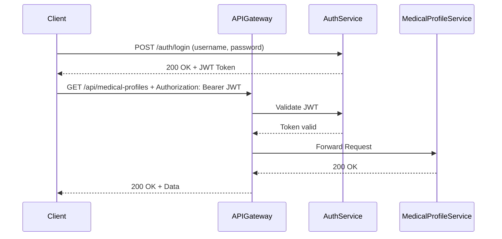
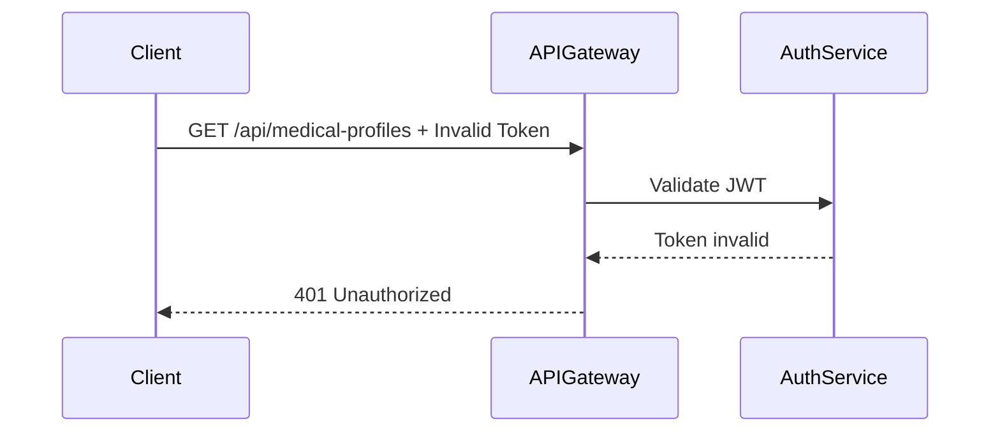

# Auth Service

The auth-service is a core microservice in the MediCore system responsible for handling user authentication and authorization across all downstream services. It issues JWT tokens after validating user credentials, enabling secure, stateless access to protected endpoints through the API Gateway.

---

## Securing Microservices with JWT Authentication

With the **API Gateway** now acting as the central entry point to our microservices architecture, the next critical step is to integrate a robust **authentication and authorization** mechanism. This will ensure that our services are **not publicly accessible** to unauthorized users and follow **secure, token-based access control**.

### Current Limitation

Until now, services like `medical-profile-service` were **openly accessible** from the internet, which poses significant **security risks** in production environments. Any client could make unauthenticated requests directly to sensitive endpoints.

---

## What We're Building Next

To mitigate this, we're introducing a **dedicated Authentication Service** that will manage user identities and issue **JSON Web Tokens (JWTs)**. This approach enables **stateless, secure communication** across our distributed system.


### Integration Plan

1. **Create a New Microservice: `auth-service`**

* Built using Spring Boot
* Exposes endpoints for user registration and login

2. **User Management**

* Connects to a dedicated **Auth DB** (e.g., PostgreSQL)
* Stores user records with **username** and **(hashed) password**

3. **Login Endpoint & JWT Issuance**

* Clients authenticate by sending `POST /auth/login` with valid credentials
* On successful login, a **JWT** is issued and returned to the client

---

## Securing Access via Gateway

Once a client receives a valid JWT, all subsequent requests to protected endpoints (e.g., `/api/medical-profiles`) must include this token in the `Authorization` header:

```http
Authorization: Bearer <JWT_TOKEN>
```

### 🔁 End-to-End Request Flow with JWT



If the JWT is invalid or expired:



---

## Why This Matters

This architecture:

* **Secures All Downstream Services** — No direct access to any microservice without a valid token
* **Centralizes Authentication Logic** — Gateway and Auth service control all access points
* **Scales Effortlessly** — New services can be protected by updating gateway rules only
* **Stateless Security** — No session management needed, thanks to JWT

---

## What’s Next

We'll be implementing:

* [ ] `auth-service` Spring Boot microservice with user entity and database
* [ ] Secure login endpoint that issues JWTs
* [ ] Token validation logic in `api-gateway` using custom filters or global filters
* [ ] Middleware integration to pass the validated requests to downstream services

---

## Conclusion

This section demonstrates:

* Real-world implementation of **microservice authentication patterns**
* Proficiency in **Spring Boot**, **JWT**, and **API Gateway** security
* Dockerized, scalable service design that follows **DevOps-ready** practices
* Preparedness for **production-grade deployment** with centralized auth and routing

---
