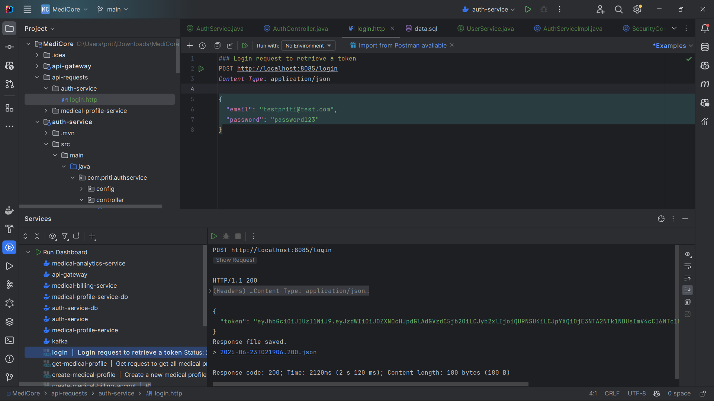

# Auth Service

The auth-service is a core microservice in the MediCore system responsible for handling user authentication and authorization across all downstream services. It issues JWT tokens after validating user credentials, enabling secure, stateless access to protected endpoints through the API Gateway. This service acts as the **security backbone** of the platform, ensuring only authenticated clients can access protected resources.

---

## Table of Contents
- [Securing Microservices with JWT Authentication](#securing-microservices-with-jwt-authentication)
- [Auth Service Tech Stack](#auth-service-tech-stack)
- [Auth Service Features Implemented](#auth-service-features-implemented)
- [Auth Service Database Setup](#auth-service-database-setup)
- [Auth Service Docker Integration](#auth-service-docker-integration)
- [Auth Service Security Configuration](#auth-service-security-configuration)
- [Auth Service Conclusion](#auth-service-conclusion)

---

## Securing Microservices with JWT Authentication

With the **API Gateway** now acting as the central entry point to our microservices architecture, the next critical step is to integrate a robust **authentication and authorization** mechanism. This will ensure that our services are **not publicly accessible** to unauthorized users and follow **secure, token-based access control**.

### Current Limitation

Until now, services like `medical-profile-service` were **openly accessible** from the internet, which poses significant **security risks** in production environments. Any client could make unauthenticated requests directly to sensitive endpoints.


### What We're Building

To mitigate this, we're introducing a **dedicated Authentication Service** that will manage user identities and issue **JSON Web Tokens (JWTs)**. This approach enables **stateless, secure communication** across our distributed system.


### Purpose & Motivation

As MediCore evolves into a modular, scalable ecosystem of services, ensuring secure access control becomes critical. Initially, services like `medical-profile-service` were publicly accessible — a major security risk. The `auth-service` addresses this by:

- Validating user credentials (email & password)
- Issuing signed JWT tokens on successful login
- Enabling downstream services to trust requests routed through the gateway


### Securing Access via Gateway

Once a client receives a valid JWT, all subsequent requests to protected endpoints (e.g., `/api/medical-profiles`) must include this token in the `Authorization` header:

```http
Authorization: Bearer <JWT_TOKEN>
```

### End-to-End Request Flow with JWT


If the JWT is invalid or expired:


### Why This Matters

This architecture:

* **Secures All Downstream Services** — No direct access to any microservice without a valid token
* **Centralizes Authentication Logic** — Gateway and Auth service control all access points
* **Scales Effortlessly** — New services can be protected by updating gateway rules only
* **Stateless Security** — No session management needed, thanks to JWT

---


## Auth Service Tech Stack

- **Java 21**
- **Spring Boot 3**, **Maven**
- **Spring Security** (Stateless mode)
- **Spring Data JPA (Hibernate)**
- **PostgreSQL** (Docker container)
- **jjwt** (Java JWT library)
- **Dockerized Deployment** with multistage build
- **SpringDoc OpenAPI UI** for testing endpoints
- **BCrypt** for password hashing

---

## Auth Service Features Implemented

### User Authentication

- Verifies user credentials stored in a PostgreSQL database
- Uses `BCryptPasswordEncoder` for password hashing and validation
- Provides a clean, layered architecture: `DTO → Controller → Service → Repository`

### JWT Token Issuance

- Generates signed JWTs with embedded claims (`email`, `role`)
- Uses secret key stored in environment variable (`JWT_SECRET`)
- Tokens are valid for 10 hours and used for stateless authorization

### DTOs and Validation

- `LoginRequestDTO`: Validates login payload using annotations
- `LoginResponseDTO`: Encapsulates the issued JWT token

### Stateless Login Endpoint

- `POST /login` authenticates users and returns token
- Returns `401 Unauthorized` if credentials are invalid
- Uses `Optional<String>` chaining for clean, functional logic

### Testing and Verification

- HTTP requests tested locally via IntelliJ and Postman




---

## Auth Service Database Setup

- PostgreSQL container: `auth-service-db`
- Port: `5001:5432` (local development)
- Volume mounted for persistence
- Admin user seeded via `data.sql`:
    - Email: `testpriti@test.com`
    - Password: `password` (BCrypt-hashed)


---


## Auth Service Docker Integration

- Exposed port: `8085` (for development only)
- Docker image built via multistage Dockerfile
- Environment variables passed via Docker run configuration:
    - `SPRING_DATASOURCE_URL`
    - `SPRING_DATASOURCE_USERNAME`
    - `SPRING_DATASOURCE_PASSWORD`
    - `SPRING_JPA_HIBERNATE_DDL_AUTO`
    - `SPRING_SQL_INIT_MODE`
    - `JWT_SECRET`
- Connected to `internal` Docker network for inter-service communication


---

## Auth Service Security Configuration

- Stateless, CSRF disabled (API Gateway handles external validation)
- All requests are permitted at auth-service level (trusted traffic from gateway only)
- Spring Security filter chain customized
- Separation of concerns: AuthService validates tokens, downstream services remain clean

---

## Auth Service Conclusion

This section demonstrates:

* Real-world implementation of **microservice authentication patterns**
* Proficiency in **Spring Boot**, **JWT**, and **API Gateway** security
* Dockerized, scalable service design that follows **DevOps-ready** practices
* Preparedness for **deployment** with centralized auth and routing
* Stateless token issuance and centralized validation via gateway

---
