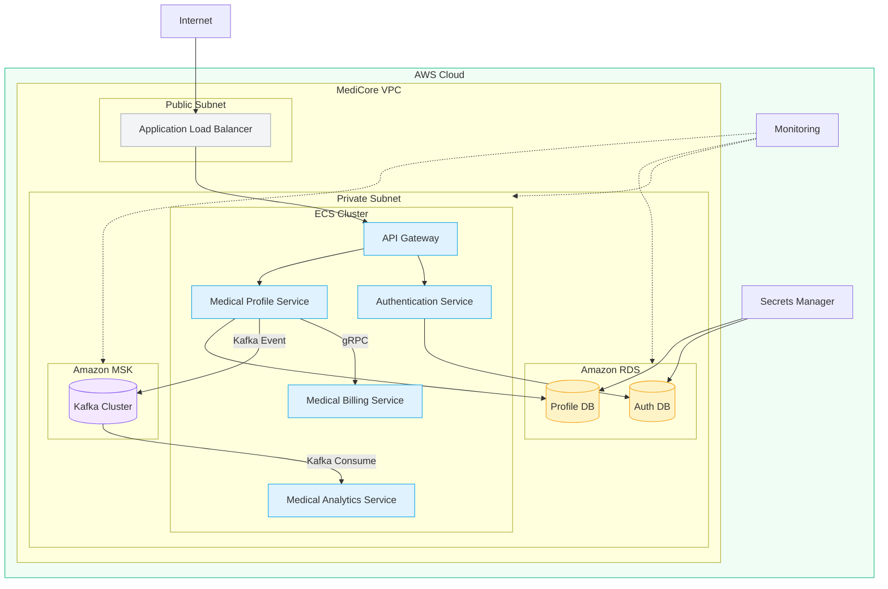
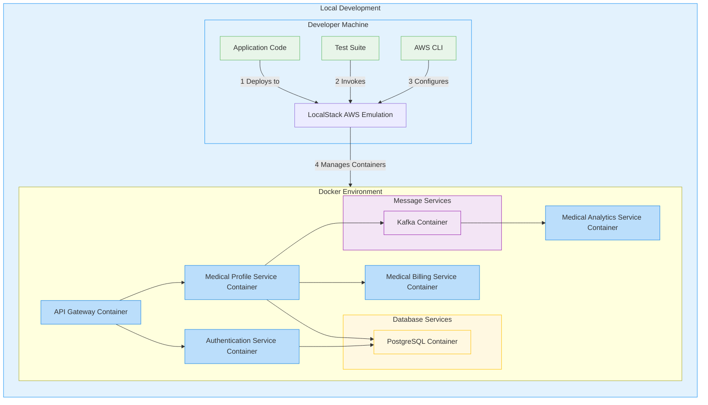
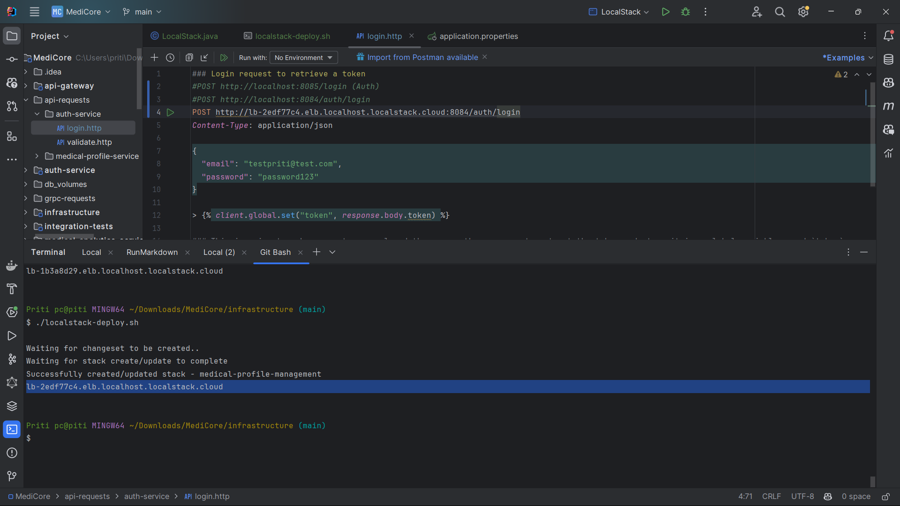
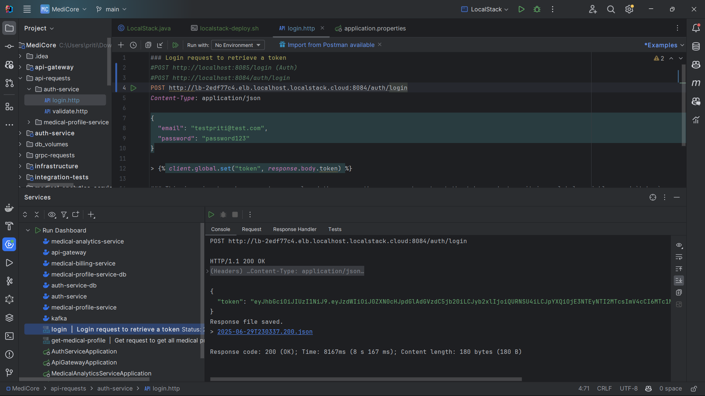
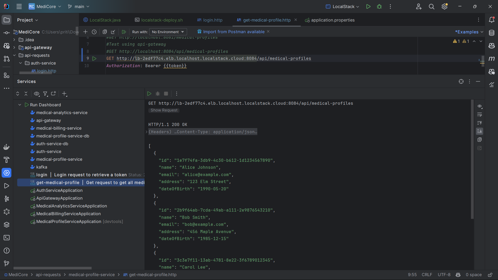
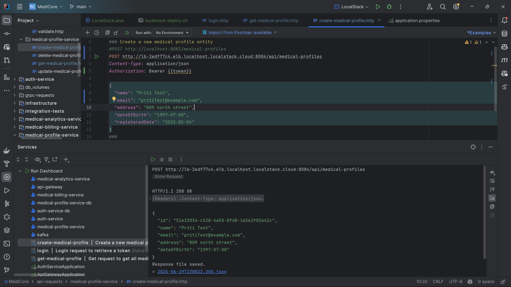
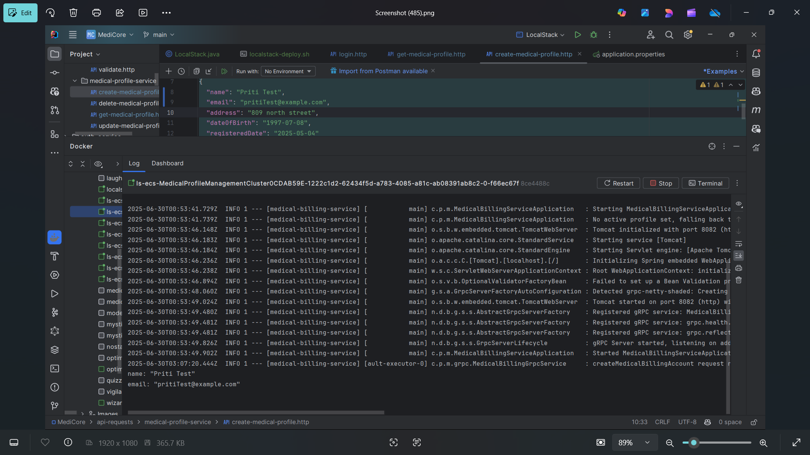

# MediCore Infrastructure – AWS CDK + LocalStack

This module defines the complete cloud infrastructure for the **MediCore Healthcare Microservices Platform**, using **AWS CDK (Java)**. It supports both **production deployments on AWS** and **local emulation via LocalStack**, enabling realistic enterprise testing and CI/CD integration.

The infrastructure provisions:

* VPC & private subnets
* ECS Fargate for containerized microservices
* ALB (Application Load Balancer) for routing
* RDS (PostgreSQL) for persistent storage
* MSK (Kafka) for event-driven communication
* CloudWatch for centralized logging and health monitoring

---
## Table of Contents
1. [Technology Stack](#technology-stack)
2. [Core Architecture](#core-architecture)
3. [Deployed Microservices](#deployed-microservices)
4. [Architecture Diagram](#architecture-diagram)
5. [Configuration Details](#configuration-details)
6. [Service Dependency Overview](#service-dependency-overview)
7. [Local Deployment Instructions](#local-deployment-instructions)
8. [CI/CD Integration](#cicd-integration)
9. [Security Considerations](#security-considerations)
10. [Result](#result)

## Technology Stack

* **Infrastructure as Code**: AWS CDK (Java)
* **Cloud Runtime**: ECS Fargate (serverless compute)
* **Network Layer**: VPC with subnets
* **Messaging**: MSK (Kafka)
* **Databases**: Amazon RDS (PostgreSQL)
* **Traffic Management**: ALB (Application Load Balancer)
* **Local Emulation**: LocalStack
* **Monitoring**: CloudWatch Logs, Health Checks
* **Containerization**: Docker

---

## Core Architecture

### Networking

* **VPC**: Spanning two availability zones
* **Subnets**:

    * Public: for ALB
    * Private: for ECS services, RDS, and MSK
* **Security**:

    * Services isolated in private subnets
    * No public access to RDS or Kafka brokers

### Databases (RDS)

* **PostgreSQL (v17.2)**:

    * `auth-service-db`
    * `medical-profile-service-db`
* **Configuration**:

    * Instance type: `t3.micro`
    * 20 GB storage
    * Admin credentials managed via AWS Secrets Manager

### Messaging (Kafka)

* **AWS MSK**:

    * Kafka version: 2.8.0
    * Cluster name: `kafka-cluster`
    * 2 broker nodes, AZ-distributed

### Compute (ECS + Fargate)

* **Cluster**: `MedicalProfileManagementCluster`
* **Launch type**: Fargate (serverless, containerized)
* **Namespace**: `medical-profile-management.local`

### API Gateway

* Configured using `ApplicationLoadBalancedFargateService`
* Routes all external traffic
* Uses environment variables:

    * `SPRING_PROFILES_ACTIVE=prod`
    * `AUTH_SERVICE_URL` (used for JWT validation)

---

## Deployed Microservices

| Service                     | Ports      | Dependencies                | Description                           |
| --------------------------- | ---------- | --------------------------- | ------------------------------------- |
| `auth-service`              | 8085       | PostgreSQL                  | JWT-based authentication              |
| `medical-profile-service`   | 8081       | RDS, Kafka, gRPC to billing | Profile management and event emission |
| `medical-billing-service`   | 8082, 9001 | -                           | Billing logic with gRPC support       |
| `medical-analytics-service` | 8083       | Kafka                       | Consumes profile events for analytics |
| `api-gateway`               | 8084 (ALB) | Routes to internal services | Central API entry point               |

---

## Architecture Diagram

[//]: # (```mermaid)

[//]: # (flowchart TB)

[//]: # (    subgraph PublicSubnet)

[//]: # (        A[ALB<br>Application Load Balancer])

[//]: # (    end)

[//]: # ()
[//]: # (    subgraph PrivateSubnet)

[//]: # (        A --> G[API Gateway<br>Fargate Service])

[//]: # ()
[//]: # (        G --> S1[Auth Service])

[//]: # (        G --> S2[Medical Profile Service])

[//]: # (        G --> S3[Medical Billing Service])

[//]: # (        G --> S4[Medical Analytics Service])

[//]: # ()
[//]: # (        S1 --> D1[&#40;auth-service-db&#41;])

[//]: # (        S2 --> D2[&#40;medical-profile-service-db&#41;])

[//]: # (        S2 -->|gRPC| S3)

[//]: # (        S2 -->|Kafka Events| K[Kafka Cluster])

[//]: # (        S4 -->|Kafka Consume| K)

[//]: # (    end)

[//]: # ()
[//]: # (    style A fill:#f3f4f6,stroke:#ccc)

[//]: # (    style G fill:#dbeafe,stroke:#3b82f6)

[//]: # (    style S1,S2,S3,S4 fill:#e0f2fe)

[//]: # (    style D1,D2 fill:#fef3c7)

[//]: # (    style K fill:#f3e8ff,stroke:#8b5cf6)

[//]: # (```)





---

## Configuration Details

### Database Connectivity

```java
jdbc:postgresql://<endpoint>:5432/<service>-db
Username: admin_user
Password: <retrieved from Secrets Manager>
```

### Kafka Properties

```properties
bootstrap.servers=localhost.localstack.cloud:4510,4511,4512
group.id=medical-analytics-group
auto.offset.reset=earliest
```

### Health Checks

* TCP-based checks
* 30-second interval
* Fails after 3 consecutive failures

---

## Service Dependency Overview

```
api-gateway (8084)
  └─ auth-service (8085)
     └─ RDS (auth-service-db)
medical-profile-service (8081)
  ├─ RDS (medical-profile-service-db)
  ├─ medical-billing-service (8082/9001)
  └─ Kafka
medical-analytics-service (8083)
  └─ Kafka
```

---

## Local Deployment Instructions

### Step 1: Build Docker Images

```bash
docker build -t auth-service:latest ./auth-service
docker build -t medical-profile-service:latest ./medical-profile-service
docker build -t billing-service:latest ./medical-billing-service
docker build -t analytics-service:latest ./medical-analytics-service
docker build -t api-gateway:latest ./api-gateway
```

### Step 2: Generate Infrastructure

```bash
cd infrastructure
mvn clean install
```

This will output the CloudFormation template at `cdk.out/localstack.template.json`.

### Step 3: Deploy to LocalStack

Create and run the following script:

```bash
#!/bin/bash
set -e

ENDPOINT="http://localhost:4566"

aws --endpoint-url=$ENDPOINT cloudformation deploy \
    --stack-name medicore \
    --template-file "./cdk.out/localstack.template.json"

aws --endpoint-url=$ENDPOINT elbv2 describe-load-balancers \
    --query "LoadBalancers[0].DNSName" --output text
```

---

## CI/CD Integration

* CloudFormation templates automatically generated via `cdk synth`
* Bootstrapless synthesizer for local development compatibility
* Modular stacks for flexible pipeline integration
* Supports GitHub Actions, Jenkins, or GitLab CI/CD

---

## Security Considerations

* Databases run in private subnets without public access
* Secrets for database access are managed in AWS Secrets Manager
* JWT secrets are passed via environment variables
* All inter-service communication remains within the VPC

---

## Result

After successful deployment, the DNS name of the Application Load Balancer is output by the deploy script. All traffic to MediCore flows through this ALB, into the API Gateway, and finally to individual backend services.

## Testing

Ran ./localstack-deploy.sh and verified the deployment by accessing the ALB DNS name. The services are reachable, and health checks pass successfully.










---