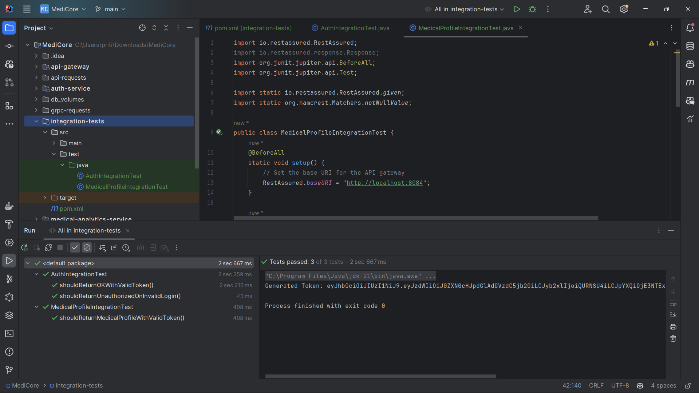

# Integration Tests for MediCore

The `integration-tests` module provides automated validation for key workflows in the MediCore microservices system. It replaces manual REST client testing by using **REST Assured** and **JUnit 5** to simulate realistic, end-to-end client interactions. This ensures core functionality—authentication, token validation, and protected service access—works reliably across the **API Gateway**, **auth-service**, and **medical-profile-service**.

---

## Table of Contents
- [Why Integration Testing?](#why-integration-testing)
- [Integration Tests Tech Stack](#integration-tests-tech-stack)
- [Test Strategy](#test-strategy)
- [Setup & Configuration](#setup--configuration)
- [Implemented Test Cases](#implemented-test-cases)
- [How to Run the Tests](#how-to-run-the-tests)
- [Integration Tests Output](#integration-tests-output)
- [Integration Tests Summary](#integration-tests-summary)

---

## Why Integration Testing?

Until this point, we have been manually verifying system functionality by issuing requests using IntelliJ's REST client and reading responses or logs. This approach is fine for early development, but it becomes inefficient and error-prone as the system grows. Each time we want to validate a flow (e.g., login + access protected resource), we:

- Send a login request manually to get a token
- Use the token into a second request
- Hit the medical-profile endpoint with authorization header

This is not scalable for larger systems.

**Solution:** We use automated **integration testing** to:
- Simulate these user flows programmatically
- Validate each piece works as expected
- Provide fast feedback before changes go to production

> Integration testing is a crucial part of any real-world CI/CD pipeline and expected in enterprise-grade systems.

---

## Integration Tests Tech Stack
- **Java 21**
- **Maven**
- **REST Assured 5.3.0** — for fluent, expressive HTTP request testing
- **JUnit Jupiter 5.11.4** — for test structure and assertions

---

## Test Strategy

These are not unit tests—they cover full **integration across services**:

### Real HTTP calls through:
- **API Gateway** (`localhost:8084`)
- Routing to downstream services (`auth-service`, `medical-profile-service`)

### Token lifecycle testing:
- Requesting a JWT from `auth-service`
- Using it to call protected routes
- Ensuring gateway applies proper **JWT validation filter**

### Assertions:
- HTTP response codes (200, 401)
- Token presence and structure
- Protected service data is accessible with valid token

---

## Setup & Configuration

Ensure all services are running in Docker:

- `auth-service` (internal)
- `medical-profile-service` (internal)
- `api-gateway` (exposed on port `8084`)

### Integration Module Structure
- Module name: `integration-tests`
- Java 21, Maven project (no parent)
- Uses JUnit + REST Assured for testing

### Dependencies
- **REST Assured 5.3.0** — for fluent, expressive HTTP request testing
- **JUnit Jupiter 5.11.4** — for test structure and assertions

---

## Implemented Test Cases

### `AuthIntegrationTest.java`

#### `shouldReturnOKWithValidToken()`
- Sends login request with valid credentials
- Expects 200 OK
- Verifies that token is returned

#### `shouldReturnUnauthorizedOnInvalidLogin()`
- Sends login with wrong credentials
- Verifies 401 Unauthorized

### `MedicalProfileIntegrationTest.java`

#### `shouldReturnMedicalProfileWithValidToken()`
- Logs in with valid credentials to receive JWT
- Uses JWT to request medical profiles
- Verifies successful response and valid data field

---

## How to Run the Tests

Run via Maven CLI:
```bash
mvn test
```

Or from IntelliJ using the green run icons on the test methods.

### Pre-requisites:
- All services running (API Gateway: `localhost:8084`)
- Database seeded with user:
    - **Email**: `testpriti@test.com`
    - **Password**: `password123`

---

## Integration Tests Output

```bash
[INFO] --- maven-surefire-plugin: Running AuthIntegrationTest
Generated Token: eyJhbGciOiJIUzI1NiJ9...
[INFO] Tests run: 2, Failures: 0, Errors: 0, Skipped: 0

[INFO] --- maven-surefire-plugin: Running MedicalProfileIntegrationTest
[INFO] Tests run: 1, Failures: 0, Errors: 0, Skipped: 0
```

All tests should pass if the system is configured correctly as shown in following image.



---

## Integration Tests Summary

This module transforms fragile, manual testing into repeatable, automated flows. It validates:

- Authentication via `auth-service`
- Secure access to `medical-profile-service` via `api-gateway`
- Proper JWT validation on protected endpoints

> Real-world projects depend on automated testing to prevent regressions and support agile delivery.
