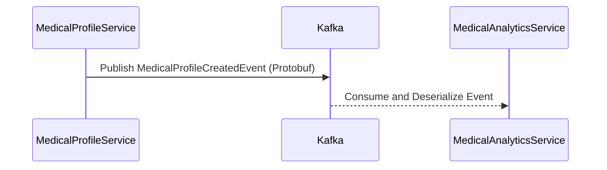

# Medical Analytics Service

The `medical-analytics-service` is a dedicated microservice within the **MediCore** ecosystem, designed to consume real-time Kafka events for analytics and insights. It listens to profile creation events emitted by the `medical-profile-service` and processes them asynchronously, allowing the platform to scale efficiently and decouple compute-intensive operations from synchronous workflows.

---

## Table of Contents
- [Overview](#overview)
- [Purpose](#purpose)
- [Architectural Role](#architectural-role)
- [Tech Stack](#tech-stack)
- [Getting Started](#getting-started)
- [Project Structure Highlights](#project-structure-highlights)
- [Configuration](#configuration)
- [Development Notes / Change Log](#development-notes--change-log)
- [Kafka Topic and Protobuf Schema](#-kafka-topic-and-protobuf-schema)
- [Summary](#summary)

## Overview

| Feature                  | Description                                                       |
| ------------------------ | ----------------------------------------------------------------- |
| **Architecture Pattern** | Event-Driven Microservice                                         |
| **Message Broker**       | Apache Kafka (using Bitnami image in KRaft mode)                  |
| **Message Format**       | Protocol Buffers (Protobuf v3)                                    |
| **Consumer Type**        | ByteArrayDeserializer → `MedicalProfileEvent.parseFrom()`         |
| **Integration**          | Connected via internal Docker network and uses shared Kafka topic |
| **Deployment Target**    | Dockerized microservice (multi-stage build with Maven & JDK 21)   |
| **Port**                 | `8083`                                                            |
| **Topic Subscribed**     | `medical-profile`                                                 |
| **Kafka Group ID**       | `medical-analytics-service`                                       |

---

## Purpose

The main responsibility of this service is to **consume and process `MedicalProfileEvent` messages** asynchronously, without adding latency to upstream services like `medical-profile-service`. Typical use cases include:

* **Analytics Collection**: Tracking usage patterns, profile creation metrics, and geographical insights.
* **Downstream Aggregation**: Preparing datasets for BI tools, reporting engines, or machine learning models.
* **Extensibility**: Enabling future real-time pipelines (e.g., Flink, Spark Streaming) without modifying the publisher.

---

## Architectural Role

This microservice participates in the MediCore event-driven architecture by subscribing to Kafka topics produced by other microservices:



---

## Tech Stack

* **Spring Boot** 3.x
* **Apache Kafka** (via `spring-kafka`)
* **Protobuf v3** (serialized messages)
* **Docker** (multi-stage build)
* **Maven** (with `protobuf-maven-plugin`)
* **Kafka Listener** with byte array deserialization
* **Internal Docker Networking** (`--network internal`) for service discovery

---

## Getting Started

### Prerequisites

Before running this service, ensure the following are already up:

* Docker-based Kafka broker container (port `9092`)
* Kafka topic `medical-profile` is created
* Other dependent services (`medical-profile-service`, etc.) are running if you want to simulate event flow
* Maven is available for local build (if not using Docker image)

---

### Run with Docker

Build and run this service via Docker as follows:

```bash
docker build -t medical-analytics-service .
```

```bash
docker run --name medical-analytics-service \
  --network internal \
  -p 8083:8083 \
  -e SPRING_KAFKA_BOOTSTRAP_SERVERS=kafka:9092 \
  medical-analytics-service:latest
```

**Note**: `--network internal` ensures communication between Kafka and this service

---

### Testing the End-to-End Flow

1. Use the HTTP POST endpoint in `medical-profile-service` to create a new profile.
2. That service publishes a `MedicalProfileEvent` to Kafka topic `medical-profile`.
3. This service consumes the event asynchronously and logs the payload.

Sample logs:

```
Received Medical Profile Event: [MedicalProfileId=ff002d9c, Name=Alice, Email=alice@example.com]
```


---

## Project Structure Highlights

| Path                                         | Purpose                                                                |
| -------------------------------------------- | ---------------------------------------------------------------------- |
| `src/main/proto/medical_profile_event.proto` | Defines Protobuf message schema used by both publisher/consumer        |
| `KafkaConsumer.java`                         | Kafka listener that consumes and deserializes Protobuf events          |
| `application.properties`                     | Kafka consumer configuration (port, deserializer, etc.)                |
| `Dockerfile`                                 | Multi-stage Docker setup with Maven + JDK 21 runtime                   |
| `pom.xml`                                    | Includes `spring-kafka`, `protobuf-java`, and protobuf compiler plugin |

---

## Configuration

Configuration is managed via `application.properties` and environment variables:

| Property                                   | Purpose                                             |
| ------------------------------------------ | --------------------------------------------------- |
| `spring.kafka.bootstrap-servers`           | Injected via environment (`kafka:9092` in Docker)   |
| `spring.kafka.consumer.group-id`           | `medical-analytics-service` (for consumer grouping) |
| `spring.kafka.consumer.key-deserializer`   | String deserializer                                 |
| `spring.kafka.consumer.value-deserializer` | Byte array (Protobuf binary data)                   |
| `server.port`                              | 8083                                                |

You can override any of these via Docker `-e` flags or IntelliJ’s run config.

---

## Development Notes / Change Log

* Created a standalone Spring Boot module `medical-analytics-service`
* Added dependencies: `spring-kafka`, `protobuf-java`, test utilities
* Compiled `medical_profile_event.proto` using `protobuf-maven-plugin`
* Implemented Protobuf deserialization logic in Kafka listener
* Logged received profile events for observability and further processing
* Dockerized the application using multi-stage Maven-JDK setup
* Successfully verified end-to-end Kafka consumption from Dockerized publisher
* Integrated into Docker internal network for seamless communication

---

## Kafka Topic and Protobuf Schema

**Topic Subscribed**: `medical-profile`
**Message Format**: `MedicalProfileEvent` (Protobuf v3)

```protobuf
message MedicalProfileEvent {
  string medicalProfileId = 1;
  string name = 2;
  string email = 3;
  string event_type = 4;
}
```

This schema is shared with the `medical-profile-service` and version-controlled under `src/main/proto`.

---


## Summary

The `medical-analytics-service` enhances the MediCore platform's responsiveness, scalability, and extensibility by processing events in a non-blocking, real-time manner. Its decoupled design allows future evolution — such as integrating with BI tools or machine learning pipelines — without impacting upstream services.

---