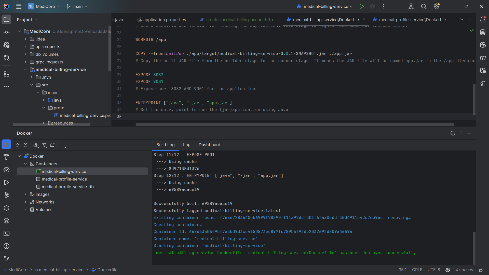
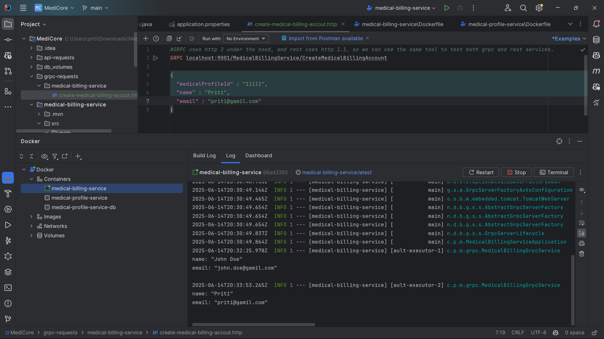

# Medical Billing Service

The `medical-billing-service` is a gRPC-based microservice in the MediCore ecosystem responsible for handling billing account operations. It exposes gRPC endpoints for other services (like `medical-profile-service`) to create and manage medical billing accounts. This service is designed using Spring Boot 3.5.0 and Java 21, and communicates using Protocol Buffers over gRPC.

---

## Table of Contents

- [Features](#features)
- [Tech Stack](#tech-stack)
- [Project Structure](#project-structure)
- [Proto Definition](#proto-definition)
- [gRPC Server Implementation](#grpc-server-implementation)
- [Running the Service](#running-the-service)
- [Docker Support](#docker-support)
- [Testing gRPC Requests](#testing-grpc-requests)
- [Service-to-Service Communication](#service-to-service-communication)
- [Development Notes](#development-notes)

---

## Features

- Exposes a gRPC endpoint to create a billing account.
- Can be invoked by client services using Protocol Buffers.
- Logs incoming gRPC requests.
- Returns mock responses (to be replaced with real logic).
- Built with modular, scalable microservice architecture in mind.

---

## Tech Stack

| Layer            | Technology                          |
|------------------|--------------------------------------|
| Language         | Java 21                              |
| Framework        | Spring Boot 3.5.0                    |
| RPC Protocol     | gRPC                                 |
| Proto Compiler   | Protobuf 3.25.5                      |
| Build Tool       | Maven                                |
| gRPC Java Plugin | `protoc-gen-grpc-java` v1.68.1       |
| Logging          | SLF4J (Simple Logging Facade for Java) |

---

## Proto Definition

The gRPC service and message contracts are defined in:

```
src/main/proto/medical_billing_service.proto
```

### Sample Excerpt:

```proto
service MedicalBillingService {
  rpc CreateMedicalBillingAccount(MedicalBillingRequest) returns (MedicalBillingResponse);
}
```

### Options Used

```proto
option java_multiple_files = true;
option java_package = "billing";
```

---

## gRPC Server Implementation

The service class is implemented in:

```
src/main/java/com/priti/medicalbillingservice/grpc/MedicalBillingGrpcService.java
```

It extends the generated `MedicalBillingServiceImplBase` and handles incoming RPCs.

### Key Points:

- Annotated with `@GrpcService` (from grpc-spring-boot-starter).
- Logs the incoming request.
- Extends the auto-generated base class from the compiled proto
- Sends back a mock response containing an account ID and status

---

## Running the Service

### Prerequisites

- Java 21+
- Maven 3.8+
- Docker (optional, for DB or containerization)

### Steps

1. Compile the `.proto` definitions and generate sources:

```bash
./mvnw clean compile
```

2. Run the Spring Boot application:

```bash
./mvnw spring-boot:run
```

The gRPC server will start and listen on the configured port (default: `9001`).

> **Port Summary**:
>
> - `8082` – Spring Boot HTTP server (used for actuator or admin purposes)
> - `9001` – gRPC server port (used for service-to-service communication)

---

---

## Docker Support

This service can be containerized using a Dockerfile like below (example):

```dockerfile
FROM eclipse-temurin:21-jdk-alpine
WORKDIR /app
COPY target/medical-billing-service-*.jar app.jar
ENTRYPOINT ["java", "-jar", "app.jar"]
```

You can build and run the image:

```bash
docker build -t medical-billing-service .
docker run -p 9001:9001 medical-billing-service
```
If using Spring Boot actuator endpoints or HTTP admin tools, expose port `8082` as well:
>
> ```bash
> docker run -p 8082:8082 -p 9001:9001 medical-billing-service
> ```



---

## Testing gRPC Requests

We use a custom folder structure for gRPC test requests:

```
grpc-requests/
└── medical-billing-service/
    └── Create-medical-billing-account.http
```

This `.http` file can be executed using IntelliJ IDEA or tools like `grpcurl` to simulate real client calls.



---

## Service-to-Service Communication

The `medical-profile-service` module acts as the gRPC client and calls the `CreateMedicalBillingAccount` RPC when a new profile is created. This validates inter-service communication using gRPC.


---


## Service Integration

### gRPC Client: `medical-profile-service`

This service is consumed by `medical-profile-service`, which acts as a gRPC client and calls `CreateMedicalBillingAccount` when a medical profile is created.

#### Integration Workflow:

1. A REST API call to `medical-profile-service` creates a new medical profile.
2. Internally, it triggers a gRPC request to `medical-billing-service`.
3. The billing service responds with a generated account ID and status.

#### Shared Proto File:

The `.proto` file is manually copied between both services under `src/main/proto/` to keep them in sync.

---

## Development Notes

- Proto files are manually copied across services for now.
- All proto compilation is handled by `protobuf-maven-plugin` configured in `pom.xml`.
- Proto classes are generated in the `target/generated-sources` directory.
- Business logic is not implemented yet; only structure and connectivity are in place.

---

## Future Enhancements

- Implement actual business logic for billing account creation.
- Use a centralized `.proto` management strategy (e.g., separate repo).

---

