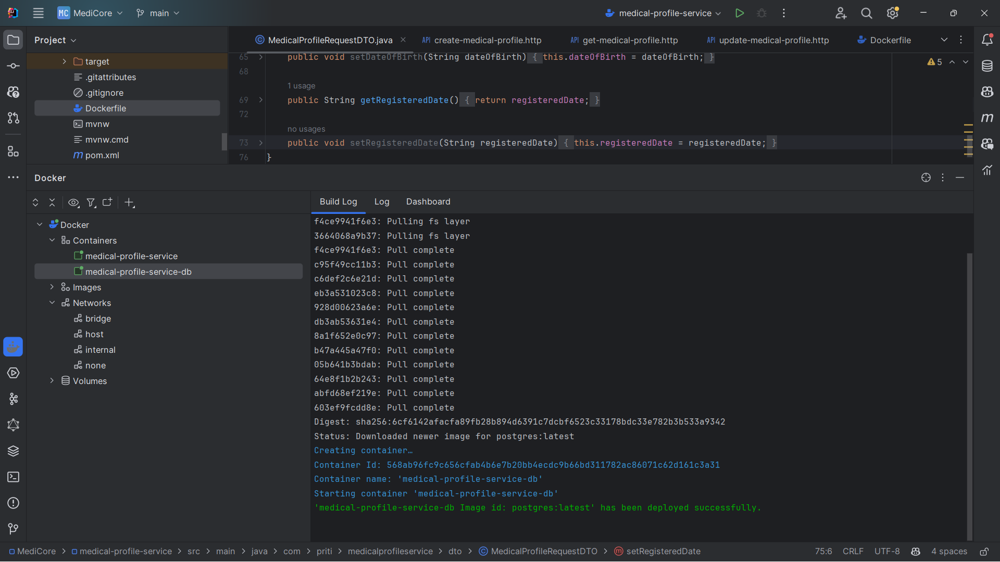
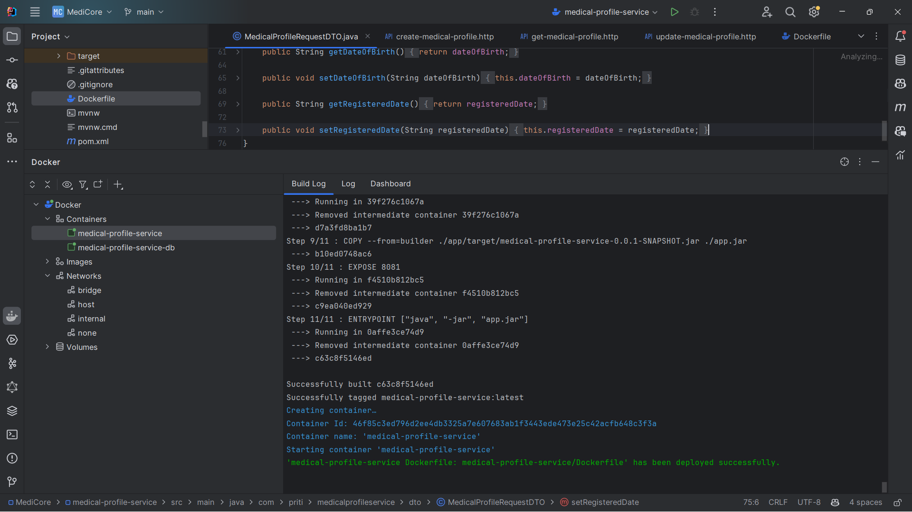
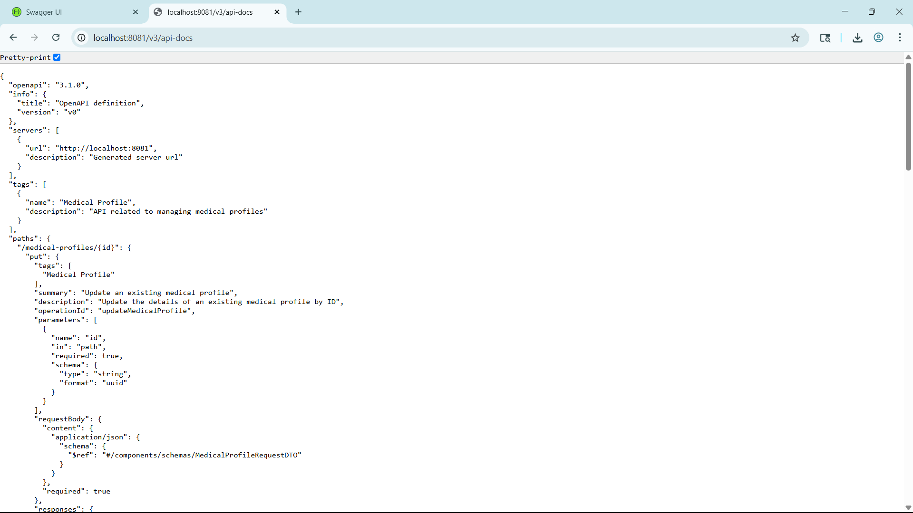
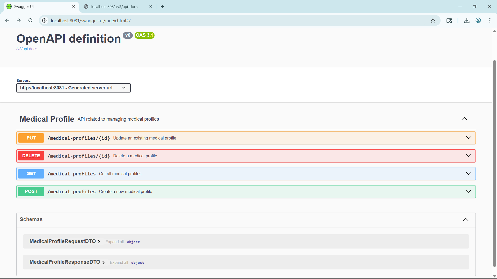
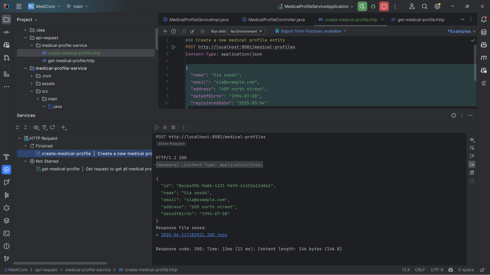
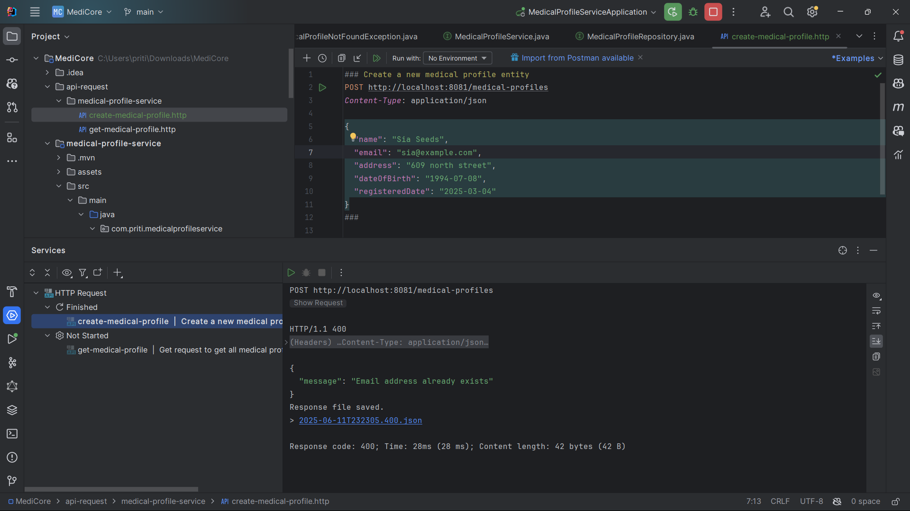
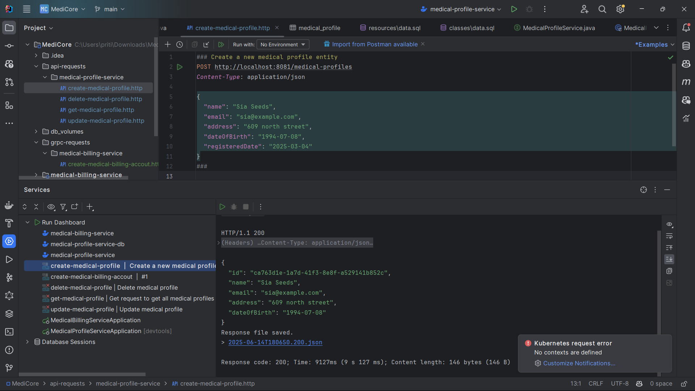

# Medical Profile Service

A microservice built with **Spring Boot 3.5.0**, **Java 21 (Oracle JDK)**, and **PostgreSQL**. This service is part of a larger **MediCore - Medical Profile Management System** project. It is container-ready, supports both REST and gRPC-based communication and will be integrated with **Kafka**, **AWS**, and **Docker** for cloud deployment and communication.

---

## Table of Contents

- [Features](#features)
- [Tech Stack](#tech-stack)
- [Dependencies](#dependencies)
- [Project Setup](#project-setup)
- [Development Configuration](#development-configuration)
- [Run Locally Using H2 DB](#run-locally-using-h2-db)
- [Access H2 Console](#access-h2-console)
- [Docker Setup](#docker-setup)
  - [PostgreSQL Container](#postgresql-container)
  - [Dockerfile For Application](#dockerfile-for-application)
  - [Docker Run Configuration](#docker-run-configuration)
- [PostgreSQL Configuration in `application.properties`](#postgresql-configuration-in-applicationproperties)
- [IntelliJ DB Integration](#intellij-db-integration)
- [API Testing in Dockerized Setup](#api-testing-in-dockerized-setup)
- [Global Error Handling](#global-error-handling)
- [OpenAPI Documentation](#openapi-documentation)
- [gRPC Integration](#grpc-integration)
- [Asynchronous Event-Driven Communication with Kafka](#asynchronous-event-driven-communication-with-kafka)
- [Development Notes / Change Log](#development-notes--change-log)

---

## Features

- **RESTful API**: Provides endpoints to create, retrieve, update, and delete medical profiles.
- **Layered Architecture**: Follows a clean separation of concerns across Controller, Service, Repository, DTO, Model, and Mapper layers.
- **Validation System**:
  - Field-level annotations ensure input integrity.
  - **Grouped validation** using interfaces (e.g. `CreateMedicalProfileValidationGroup`) applies context-specific rules like "registration time" only during create operations.
- **DTO and Mapper Support**: Maps between entities and DTOs to keep the API contract clean and decoupled from internal database models.
- **gRPC Client Integration**: Communicates with `medical-billing-service` to auto-create billing accounts when profiles are added.
- **OpenAPI Documentation**: Integrated with SpringDoc using `@Tag` and `@Operation` annotations to generate Swagger-compatible docs.
- **Global Exception Handling**: Centralized with `@ControllerAdvice` for consistent, structured error responses.
- **Database Flexibility**:
  - **H2 in-memory** for lightweight development/testing.
  - **PostgreSQL** via Docker for production-ready persistence.
- **Containerized Deployment**: Built using a multi-stage Dockerfile for efficient builds and runs alongside PostgreSQL in Docker network.

---

## Tech Stack

| Category   | Technology           | Description                                        |
| ---------- |----------------------| -------------------------------------------------- |
| Backend    | Spring Boot 3.5.0    | Framework for building RESTful microservices       |
| Language   | Java 21 (Oracle JDK) | Long-Term Support version for enterprise stability |
| Database   | PostgreSQL, H2 (dev) | PostgreSQL for production, H2 for dev/testing      |
| Validation | Hibernate Validator  | Annotation-based request and entity validation     |
| Docs       | SpringDoc OpenAPI    | Auto-generates Swagger UI from code annotations    |
| Container  | Docker               | Containerization using multi-stage build           |
| Messaging  | Kafka (planned)      | For event-driven communication between services    |
| Cloud      | AWS (planned)        | For deploying microservices in the cloud           |

---

## Dependencies

- `spring-boot-starter-web`: For creating REST APIs
- `spring-boot-starter-data-jpa`: For interacting with databases using JPA
- `spring-boot-devtools`: Enables hot reload during development
- `spring-boot-starter-validation`: Supports bean validation using annotations
- `postgresql`: JDBC driver to connect to PostgreSQL
- `com.h2database:h2`: In-memory database for development and testing
- `springdoc-openapi-starter-webmvc-ui`: To generate OpenAPI docs with Swagger UI
- `io.grpc:grpc-netty-shaded` : For gRPC server implementation
- `io.grpc:grpc-stub` : For gRPC client stubs
- `io.grpc:grpc-protobuf` : For Protocol Buffers support in gRPC
- `com.google.protobuf:protobuf-java` : For Protocol Buffers Java support
- `net.devh:grpc-client-spring-boot-starter` : For integrating gRPC client with Spring Boot

---

## Project Setup

### Prerequisites

- Java 21 installed
- Maven or Gradle (depending on your build tool)
- IDE (e.g., IntelliJ IDEA)
- Docker

## Development Configuration

- `application.properties`: Configured to use the H2 database for ease of development
- `server.port=8081`: Port changed from default `8080` to avoid conflicts
- `data.sql`: Auto-loaded by Spring Boot to insert dummy data at startup

---

### Run Locally using H2 DB

1. Clone the repository
2. Navigate to `medical-profile-service`
3. Run the application using your IDE or command line:
   ```bash
   ./mvnw spring-boot:run
   # or
   ./gradlew bootRun
   ```
4. Access the API at: `http://localhost:8081/medical-profiles`

---

### Access H2 Console

Spring Boot makes it easy to view and interact with the H2 database via a browser:

- URL: `http://localhost:8081/h2-console`
- JDBC URL: `jdbc:h2:mem:testdb`
- Username: `profile`
- Password: `profile` *(unless you changed it in application.properties)*

Make Sure to uncomment H2-configuration in your `application.properties` file.
Make sure this is present in your `application.properties`:

```properties
spring.h2.console.enabled=true
spring.h2.console.path=/h2-console
```


---

## Docker Setup

### PostgreSQL Container

A PostgreSQL container was created using the latest PostgreSQL image with the following configuration:

```bash
docker run --name medical-profile-service-db \
  -e POSTGRES_USER=profile \
  -e POSTGRES_PASSWORD=profile \
  -e POSTGRES_DB=db \
  -p 5000:5432 \
  -v medical-profile-db-data:/var/lib/postgresql/data \
  --network internal \
  -d postgres:latest
```

- Port mapped: `5000:5432`
- Persistent storage: Named volume `medical-profile-db-data`
- Network: Internal Docker network named `internal`



---

### Dockerfile for Application

A multi-stage Dockerfile was created in the `medical-profile-service` directory:

### Docker Run Configuration

In IntelliJ IDEA:

- Image name: `medical-profile-service:latest`
- Container name: `medical-profile-service`
- Dockerfile path: `medical-profile-service/Dockerfile`
- Environment Variables:
   - `SPRING_DATASOURCE_URL=jdbc:postgresql://medical-profile-service-db:5432/db`
   - `SPRING_DATASOURCE_USERNAME=profile`
   - `SPRING_DATASOURCE_PASSWORD=profile`
   - `SPRING_JPA_HIBERNATE_DDL_AUTO=update`
   - `SPRING_SQL_INIT_MODE=always`
- Port Binding: `8081:8081`
- Run Option: `--network internal`

### PostgreSQL Configuration in `application.properties`

Commented out H2-related settings and retained only essential production config:



---

### IntelliJ DB Integration

- Connected to the running PostgreSQL container from IntelliJ using:
   - Name: `medical-profile-service-db`
   - JDBC URL: `jdbc:postgresql://localhost:5000/db`
   - Username: `profile`, Password: `profile`
- Verified: Tables created and dummy data from `data.sql` available in database


---

### API Testing in Dockerized Setup

Tested all `.http` request files (`GET`, `POST`, `PUT`, `DELETE`) against the Dockerized application connected to PostgreSQL. All endpoints worked as expected.


---

## API Endpoints

```
GET    /medical-profiles          # Fetch all profiles
POST   /medical-profiles          # Create new profile
PUT    /medical-profiles/{id}     # Update profile by ID
DELETE /medical-profiles/{id}     # Delete profile by ID
```


---

## OpenAPI Documentation

- Local API Docs: [http://localhost:8081/v3/api-docs](http://localhost:8081/v3/api-docs)



- Swagger UI (auto-generated): [http://localhost:8081/swagger-ui/index.html](http://localhost:8081/swagger-ui/index.html)



These are generated using annotations like `@Tag`, `@Operation`, etc., in controller classes.

You can copy the raw OpenAPI JSON from `/v3/api-docs` and paste it into [Swagger Editor](https://editor.swagger.io/) for interactive documentation.

---

## API Testing with HTTP Files

This project uses `.http` files located under `api-request/medical-profile-service/` to test API endpoints.

Examples:

- `get-medical-profile.http` – Tests `GET /medical-profiles`


- `create-medical-profile.http` – Tests `POST /medical-profiles`


- `update-medical-profile.http` – Tests `PUT /medical-profiles/{id}`


- `delete-medical-profile.http` – Tests `DELETE /medical-profiles/{id}`


You can use IntelliJ IDEA or VS Code REST Client extension to run these files.

---

## Global Error Handling

A centralized exception handling mechanism is in place using `@ControllerAdvice`. It catches and formats errors like:

- Duplicate email constraint violations
- Entity not found
- Invalid request body



This ensures consistent error responses across the API.

---

## gRPC Integration

To enable gRPC-based communication between `medical-profile-service` (the client) and `medical-billing-service` (the server), we use a **Protocol Buffers (**``**) file**. This file acts as a contract that defines:

- The structure of the request and response messages
- The gRPC service name and its RPC methods (endpoints)
- The Java package for generated classes

In our case, the file is named `medical_billing_service.proto`, and it defines a `MedicalBillingService` with an RPC method:

```proto
rpc CreateMedicalBillingAccount (BillingRequest) returns (BillingResponse);
```

This allows the profile service to send a `BillingRequest` and receive a `BillingResponse` when a medical profile is created.

### Why We Added the Proto File Here

gRPC requires both client and server to have access to the same `.proto` definition so that matching Java classes can be generated. Although the file originated in the `medical-billing-service` module (which hosts the server logic), we **copied it into the **``** directory of **`` to:

- Generate gRPC client stubs during the Maven build process
- Maintain service contract alignment with the billing service
- Avoid direct dependency sharing for now (future improvement: share via a central proto module)

This setup ensures the profile service can invoke billing RPCs with type-safe, auto-generated Java classes.

---

### Proto Setup

* Copied the shared `medical_billing_service.proto` file from `medical-billing-service` to `src/main/proto/` in `medical-profile-service`
* Configured `protobuf-maven-plugin` in `pom.xml` to compile `.proto` files into Java classes
* Ran `mvn compile` to generate gRPC stubs

### gRPC Client Implementation

* Created `MedicalBillingServiceGrpcClient` class under `grpc` package
* Uses a **blocking stub** to call `CreateMedicalBillingAccount` on the remote `medical-billing-service`
* Constructed `BillingRequest` with id, name and email from the profile

### Client Configuration

In `application.properties`:

```properties
billing.service.address=localhost
billing.service.grpc.port=9001
```

Can be overridden via environment variables in Docker setup. To support gRPC communication between containers, we updated the Docker run configuration for `medical-profile-service` to include:

- `BILLING_SERVICE_ADDRESS=medical-billing-service`
- `BILLING_SERVICE_GRPC_PORT=9001`

This ensures that the client (profile service) can successfully resolve and connect to the gRPC server (billing service) running in another container within the same Docker internal network.
These match the server container’s hostname and port within the internal Docker network.


### Profile-to-Billing Integration

* On successful creation of a **medical profile**, the service automatically invokes the gRPC client to create a **billing account** in `medical-billing-service`
* This integration is triggered inside the profile creation service logic




---

## Asynchronous Event-Driven Communication with Kafka

To decouple services and improve scalability, we use **Kafka** as the backbone for asynchronous, event-driven communication within the MediCore ecosystem.

### Why Kafka?

Till now, microservices communicates synchronously using REST APIs or gRPC in this project. While this is suitable for simple, one-to-one interactions, it introduces significant drawbacks:

* **Latency**: Each additional service call increases total processing time.
* **Tight Coupling**: Failures or slow responses in one service can block others.
* **Scalability Bottlenecks**: High request volume magnifies inter-service traffic.

By introducing **Kafka**, we transform the architecture into an **event-driven** model. Now, services **publish events** rather than making direct calls, and other services **consume these events** asynchronously.

### Use Case: Medical Profile Created Event

When a new medical profile is created in the `medical-profile-service`, it publishes a **`MedicalProfileCreatedEvent`** to a Kafka topic named:

```
medical.profile.created
```

This event includes relevant data like medical profile ID, name, email, creation time, etc.

### Event Flow Overview


### Services Listening to This Event

* **Medical Analytics Service**
  Subscribes to `medical.profile.created` to update internal metrics and reporting datasets.

* **Medical Notification Service**
  Subscribes to the same event to trigger welcome emails, alerts, or push notifications.

### Benefits

* **Non-blocking**: Profile creation doesn't wait for downstream services to respond.
* **Scalable**: Kafka handles high throughput and allows for horizontal scaling of consumers.
* **Loose Coupling**: New services can be added as subscribers without modifying the publisher.
* **Resilience**: Temporary consumer downtime doesn't affect the publishing flow (thanks to Kafka retention and replay).

---


## Development Notes / Change Log

- Added DTOs for request and response
- Developed create, update, get, delete logic in service and controller
- Implemented grouped validation
- Added custom repository methods to prevent duplicate emails
- Introduced global error handler to handle exceptions gracefully
- Verified all endpoints using `.http` request files
- Integrated SpringDoc for OpenAPI documentation
- Dockerized the application with a multi-stage Dockerfile
- Created and configured PostgreSQL container with internal Docker networking
- Connected Dockerized Spring Boot app to PostgreSQL using environment variables
- Verified DB connection via IntelliJ and tested all API endpoints in the Dockerized setup
- Implemented gRPC client to call remote billing service
- Integrated `.proto` file and compiled client stubs using Maven
- Automatically creates a billing account when a profile is created
- Configured gRPC server connection via externalized `application.properties`

---


