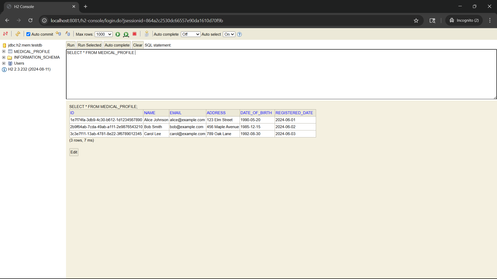

# Medical Profile Service

An enterprise-level microservice built with **Spring Boot 3.5.0**, **Java 21 (Oracle JDK)**, and **PostgreSQL**. This service is part of a larger **Medical Profile Management System ** project. It is container-ready and will be integrated with **Kafka**, **AWS**, and **Docker** for cloud deployment and communication.

---

## Features

- **REST API**: Provides an endpoint to retrieve medical profiles.
- **Layered Architecture**: Separates concerns into controller, service, and repository layers(along with model, dto, mapper).
- **Validation**: Uses annotations to enforce data integrity.
- **DTO and Mapper**: Keeps API responses clean and decoupled from database structure.
- **Dev-friendly Setup**: Uses H2 in-memory DB for rapid development and testing.

---

## Tech Stack

| Category   | Technology           | Description                                        |
| ---------- | -------------------- | -------------------------------------------------- |
| Backend    | Spring Boot 3.5.0    | Framework for building RESTful microservices       |
| Language   | Java 21 (Oracle JDK) | Long-Term Support version for enterprise stability |
| Database   | PostgreSQL, H2 (dev) | PostgreSQL for production, H2 for dev/testing      |
| Validation | Hibernate Validator  | Annotation-based request and entity validation     |
| Container  | Docker (planned)     | Will be used to containerize the service           |
| Messaging  | Kafka (planned)      | For event-driven communication between services    |
| Cloud      | AWS (planned)        | For deploying microservices in the cloud           |

---

## Dependencies Added

- `spring-boot-starter-web`: For creating REST APIs
- `spring-boot-starter-data-jpa`: For interacting with databases using JPA
- `spring-boot-devtools`: Enables hot reload during development
- `spring-boot-starter-validation`: Supports bean validation using annotations
- `postgresql`: JDBC driver to connect to PostgreSQL
- `com.h2database:h2`: In-memory database for development and testing

---

## Project Setup

### Prerequisites

- Java 21 installed
- Maven or Gradle (depending on your build tool)
- IDE (e.g., IntelliJ IDEA)

## Development Configurations

- `application.properties`: Configured to use the H2 database for ease of development
- `server.port=8081`: Port changed from default `8080` to avoid conflicts
- `data.sql`: Auto-loaded by Spring Boot to insert dummy data at startup

---

### Run Locally (using H2 DB)

1. Clone the repository
2. Navigate to `medical-profile-service`
3. Run the application using your IDE or command line:
   ```bash
   ./mvnw spring-boot:run
   # or
   ./gradlew bootRun
   ```
4. Access the API at: `http://localhost:8081/medical-profiles`

---

### Access H2 Console

Spring Boot makes it easy to view and interact with the H2 database via a browser:

- URL: `http://localhost:8081/h2-console`
- JDBC URL: `jdbc:h2:mem:testdb`
- Username: `profile`
- Password: `profile`*(unless you changed it in application.properties)*

Make sure this is present in your `application.properties`:

```properties
spring.h2.console.enabled=true
spring.h2.console.path=/h2-console
```



---

## Project Structure (So Far)

```
com.priti.medicalprofileservice
├── controller
│   └── MedicalProfileController.java      # REST endpoint to get profiles
├── model
│   └── MedicalProfile.java                # JPA Entity with validation
├── repository
│   └── MedicalProfileRepository.java      # Extends JpaRepository for DB access
├── service
│   ├── MedicalProfileService.java         # Service interface
│   └── impl
│       └── MedicalProfileServiceImpl.java     # Business logic implementation
├── dto
│   └── MedicalProfileResponseDTO.java     # Defines API response format
├── mapper
│   └── MedicalProfileMapper.java          # Converts Entity to DTO
```

---

## API Endpoint (so far)

```
GET /medical-profiles
```

Returns a list of all medical profiles in DTO format.


### Example Response


```json
[
  {
    "id": "e4b5f...",
    "name": "John Doe",
    "email": "john@example.com",
    "address": "123 Health St",
    "dateOfBirth": "1990-05-01"
  },
  "..."
]
```

---